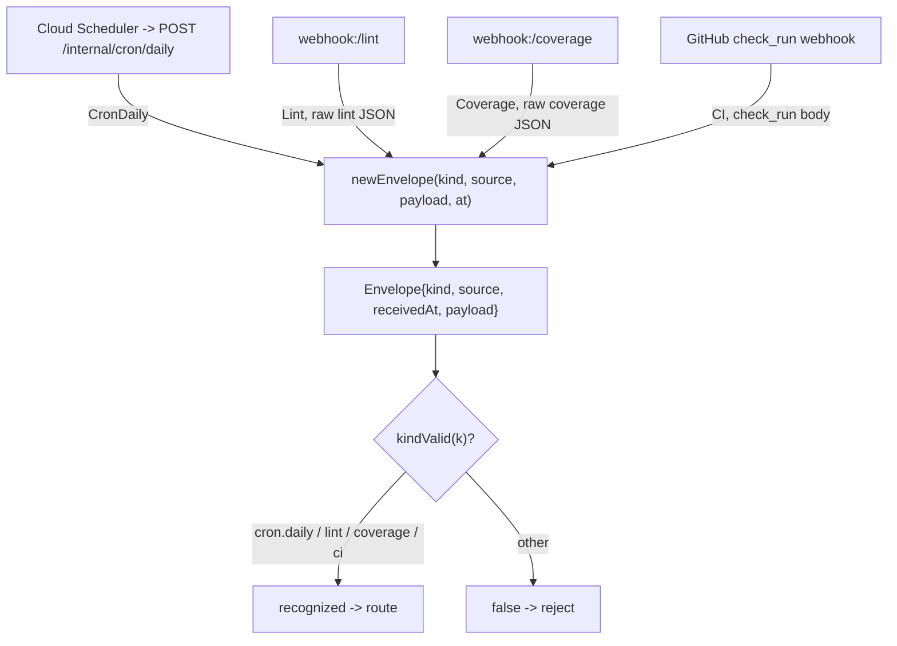

# src/ingest

The normalized `Envelope` that every ingress source is reduced to before reaching
the root agent. `Kind` identifies the trigger (cron.daily, lint, coverage,
ci); `payload` carries the raw source body for the chosen workflow to parse.



- `envelope.ts` — `Envelope`, `Kind`, `kindValid()`, `newEnvelope(...)`, and the wire codec
  (`encode` / `decode`).

Adding a new ingress (e.g. Jira) means adding a `Kind` here and a handler that emits
an `Envelope` — the root agent's routing is the only other place that changes.

## Wire codec (`encode` / `decode`)

The Cloud Tasks transport (`src/tasks`) crosses a process boundary: it serializes an
envelope to JSON, hands it to a Cloud Tasks task body, and `POST /internal/dispatch`
deserializes it. `encode`/`decode` are that codec, and the JSON form is a **cross-port
external contract** that must stay **byte-identical** across all four language ports
(Go/Python/JS/Kotlin), so the in-process backend (which passes the object directly) never
calls them.

```json
{"kind":"lint","source":"webhook:/lint","received_at":"1970-01-01T00:00:00Z","payload":"aGk="}
```

- Compact separators (no spaces), field order `kind, source, received_at, payload`.
- `received_at` is RFC 3339 with a trailing `Z` and Go-style trimmed fractional seconds
  (`.000` → none, `.500` → `.5`).
- `payload` is **standard base64** of the raw bytes (`""` when empty) — never a raw byte
  array — so an empty payload is the empty string in every port.
- `decode` is strict: an unknown kind, non-standard/junk base64 (Node's lenient decoder is
  re-encode-checked), a non-string `payload`/`source`, or a present-but-unparseable
  `received_at` is a **permanent (poison) error**. Absent or `null` `source`/`received_at`
  default to the zero value. `encode` rejects an unknown kind so both transports fail the
  same way.
