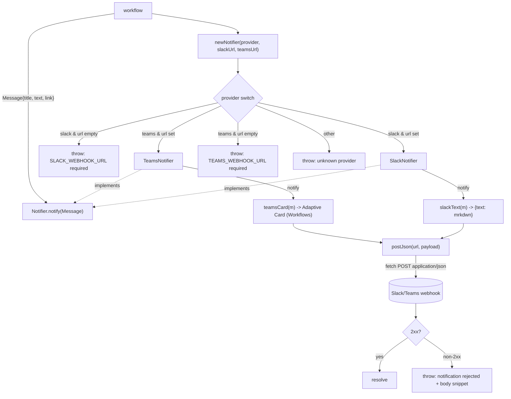

# src/notify

Posts provider-agnostic `Message`s to Slack or Microsoft Teams behind one
`Notifier` interface, so the choice is a config flag (`NOTIFY_PROVIDER`).

- `slack.ts` — Slack incoming webhook (`{ text: ... }`, mrkdwn).
- `teams.ts` — Teams **Workflows / Adaptive Card** format (the O365 connector
  MessageCard path is deprecated; we target the new one).
- `newNotifier(provider, slackUrl, teamsUrl)` picks the implementation.

Deterministic tooling — no agent imports. Tested by stubbing `fetch` and asserting on
the posted body; no real Slack/Teams calls.
