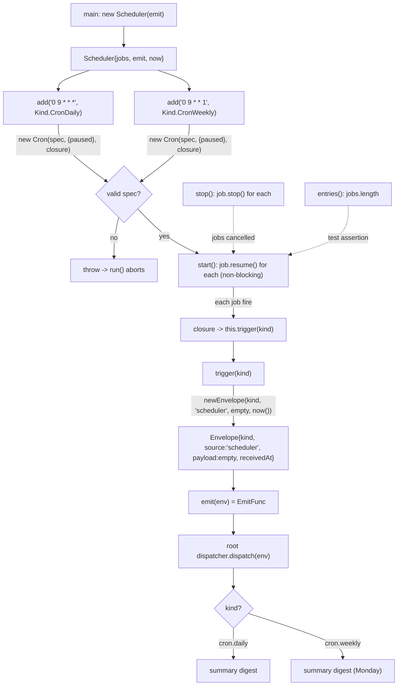

# src/scheduler

Wraps `croner` (`Cron`) to emit `ingest.Envelope`s on a schedule, so time triggers flow
through the same root-agent path as any other ingress. Deterministic tooling — no agent
imports.

## Flow

- `add(spec, kind)` registers a 5-field cron spec (e.g. `0 9 * * *` daily,
  `0 9 * * 1` Mondays); `croner` throws on an invalid spec.
- `trigger` is factored out of the cron closure so the emit path is unit-testable
  without waiting on real time; `now` is injectable via the constructor.
- `croner` has no central registry — each `Cron` is its own job. The `Scheduler` keeps a
  `jobs[]` array; jobs are created `paused` so they only begin firing on `start()`
  (add-then-start semantics). `entries()` returns `jobs.length`.

Note: the Monday lint trigger is expected to come from an external CI job posting to
`/webhooks/lint`, not from a cron here — see `.agents/standards/architecture-design.md` §8.
