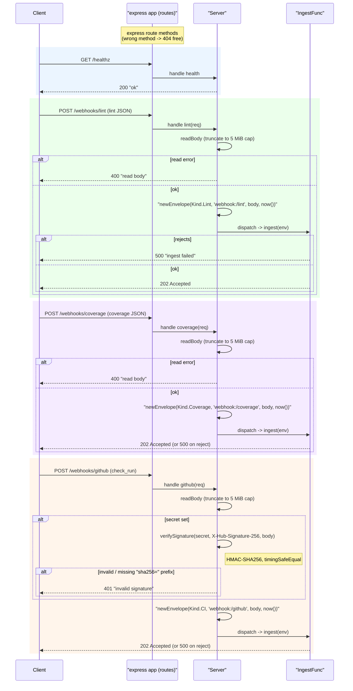

# src/webhook

The HTTP ingress. Four routes — a liveness probe plus three POST webhooks — reduce
requests to an `ingest.Envelope` and hand them to an `IngestFunc` (which should enqueue
and return fast):

## Flow

- `GET /healthz` — liveness; returns `200 "ok"`.
- `POST /webhooks/lint` — lint-fixer **kickoff** (agnostic lint JSON) -> `Kind.Lint`.
- `POST /webhooks/coverage` — coverage-fixer **kickoff** (coverage JSON) -> `Kind.Coverage`.
- `POST /webhooks/github` — fix-engine **resume** (GitHub `check_run`) -> `Kind.CI`,
  HMAC-verified via `X-Hub-Signature-256` when a secret is configured.

express returns a 404 for an unmatched method, rejecting the request before it reaches
`ingest`. Each body is read with a 5 MiB cap: oversize bodies are **truncated** to the
cap and still accepted, not rejected. The HMAC over the body uses
HMAC-SHA256 with a hex digest, compared in constant time via `node:crypto`'s
`timingSafeEqual`. Deterministic tooling — no agent imports. Fully tested with `supertest`.
