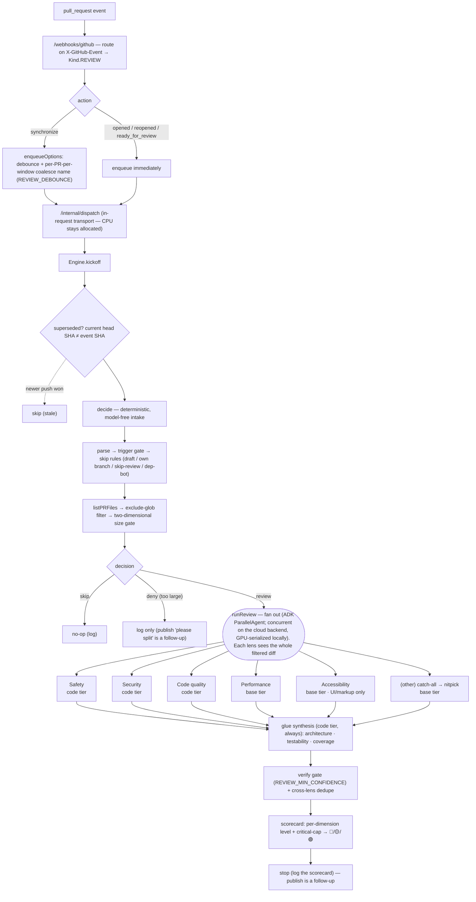

# agent/reviewer

The in-house **PR code-review** workflow. It reacts to GitHub `pull_request` events and analyzes the
diff — per-category sub-agent findings synthesized by a holistic glue pass and scored into a
count-based scorecard. This is the **detect + analyze** half: the engine stops at the scorecard.
Publishing the scored review to the PR (inline comments, a marker summary, an advisory check),
reconciliation, and standards-aware review are a follow-up; the code is structured so publish slots
in after the scorecard.

Unlike the lint/coverage fixers, the reviewer is **not** a suspend/resume fix loop: it is mostly
one-shot per `pull_request` event and does not park on `await_ci`. Its long compute runs **in-request**
via the execution transport (`Kind.REVIEW` → `/internal/dispatch`), so CPU stays allocated on Cloud
Run.

## Flow

## Trigger — native-event kickoff

The reviewer's kickoff is a **native GitHub event** (`pull_request`), not a custom POST route. The
GitHub App delivers it to the single `/webhooks/github` URL, where the handler routes by the
`X-GitHub-Event` header (`pull_request` → `Kind.REVIEW`, `check_run` → `Kind.CI`, anything else → 200
no-dispatch).

## Coalesce-to-latest — debounce + staleness

Rapid pushes to one PR are collapsed so only the latest SHA is reviewed (two parts, because the task
queue gives no ordering and cannot cancel an in-flight task):

- **Debounce at enqueue** (`Enqueue.kt`, `enqueueOptions`): a `synchronize` review is enqueued with
  `REVIEW_DEBOUNCE` delay under a per-PR-per-window dedup name, so a burst of pushes collapses to one
  delayed task. The name carries a time bucket (receipt time floored to the debounce window) so a push
  minutes later doesn't collide with the queue's ~1h name reservation. `opened`/`reopened`/
  `ready_for_review` enqueue immediately. Only the Cloud Tasks backend honors the hints.
- **Staleness at execution** (`Engine.kickoff` → `superseded`): before doing the review work, the
  engine fetches the PR's current head SHA and skips if it no longer matches the event's SHA.
  Best-effort — a lookup error proceeds rather than suppressing a real review.

## Intake pipeline

`Engine.decide` runs a deterministic, model-free intake and produces a `Decision` (skip / deny /
review):

1. **Parse** the event (`githubapi.parsePullRequestEvent`).
2. **Trigger gate** — only `opened` / `reopened` / `synchronize` / `ready_for_review` proceed.
3. **Skip rules** — draft (unless `ready_for_review`), the agent's own `automation-agent/*` branches,
   the `skip-review` label, and dependency-bot authors.
4. **Fetch** the changed files + patches (`listPRFiles`).
5. **Filter** generated/vendored/lockfile/minified/binary paths (`Filter.kt`); size is computed on the
   **filtered** set. An empty filtered diff skips.
6. **Size gate** — two-dimensional (`REVIEW_MAX_FILES` **and** `REVIEW_MAX_DIFF_BYTES`): over either
   cap denies (review-or-deny, no degrade tier).

## Review stage (category fan-out → glue → scorecard)

`Review.kt`: **fan out** one agent per applicable category over the whole filtered diff, in parallel
(ADK `ParallelAgent`). The consolidated set: Safety + Security + Code quality (code tier), Performance
+ Accessibility (base tier; accessibility only when UI/markup changed) + an `(other)` catch-all demoted
to nitpick. The **glue/synthesis** pass (code tier, always) adds architectural alignment, testability,
test coverage. Then the deterministic gates in code (`Glue.kt`): drop below `REVIEW_MIN_CONFIDENCE`,
collapse cross-lens duplicates by fingerprint. The **scorecard** (`Scorecard.kt`) is a per-dimension
severity histogram → level (🔴 any critical or ≥2 major · 🟡 any major or ≥3 medium · 🟢 else); overall
= critical-cap (any critical in security / runtime safety → 🔴) combined with the worst dimension.

ADK-Kotlin has no `LlmAgent.OutputKey`, so each lens is a code agent that calls its tier model directly
with the JSON generate-content config and emits its raw findings text — a category lens to its own
session-state key (read back by the parallel drive), the glue lens as the event content (read back by
the single-agent drive).

## Structured output

Category agents request `application/json` and describe the exact findings schema in their prompt;
`parseFindings` recovers **defensively** — it extracts the first decodable JSON array from the model
text, tolerates fences/prose, and treats a malformed body as no findings (empty = success). A
non-finite `confidence` (NaN/Infinity) is rejected at the array-validation layer. Best-effort by design;
the narrow single-lens prompts are themselves the false-positive control.

## Files

- `Reviewer.kt` — `Deps`, `Engine`, `newEngine`, `Engine.kickoff`, and the `decide` intake + skip
  helpers. Gated by `REVIEW_ENABLED` (default false, the kill switch).
- `Filter.kt` — the exclude-glob `FileFilter` and the filtered patch-byte total.
- `SizeGate.kt` — `oversize`, the two-dimensional file-count/diff-byte cap.
- `Findings.kt` — the `Finding` schema, severity/dimension normalization, `fingerprint`, and the
  defensive `parseFindings`.
- `Categories.kt` — the consolidated category set + `selectCategories` (UI-only gating).
- `Scorecard.kt` — the count-based `scoreFindings`.
- `Glue.kt` — the deterministic verify gate + cross-lens `dedupe`.
- `Review.kt` — `runReview`: the fan-out drive, glue drive, diff formatting, and instruction
  composition.
- `Enqueue.kt` — `enqueueOptions`: the debounce/coalesce transport hints.
- `AgentsSetup.kt` — pure ADK wiring (category + glue review agents, the prompt loader, the JSON
  generate-content config).
- `prompts/reviewer/*.md` — one markdown prompt per category and the glue pass (in `resources`).

Wiring: `root` registers `Kind.REVIEW` → `Engine.kickoff`; `app` builds the engine (via `newEngine`)
from config and injects the `githubapi` client. Provider SDKs stay out via `setup` helpers. Tests are
deterministic glue only — no assertions on model output.
