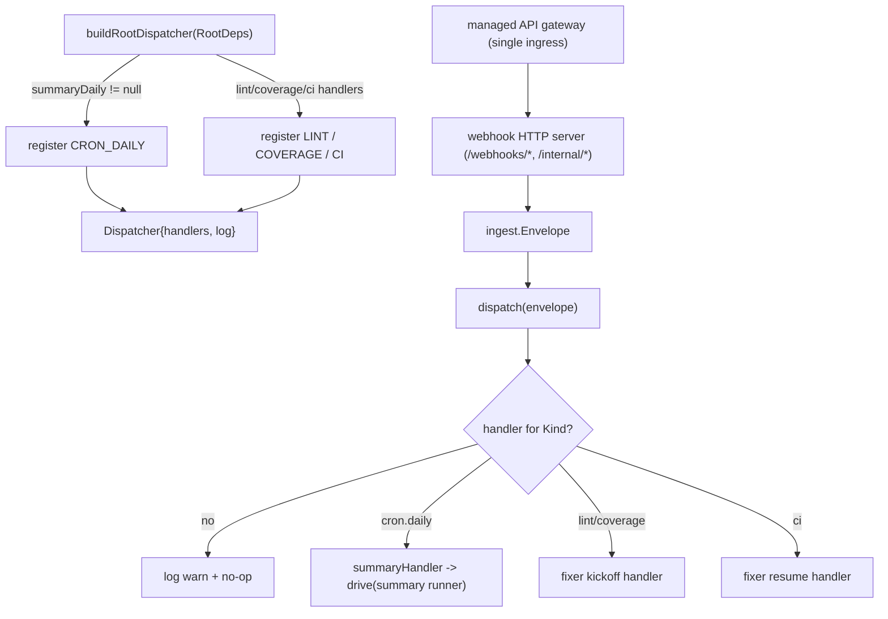

# agent.root

The dispatcher kicked off for every ingest.

## Flow

- `Dispatcher.kt` — `Dispatcher`: routes an `ingest.Envelope` to a `Handler` by `Kind`.
  Unregistered kinds are logged (via `System.Logger`) and ignored, so a not-yet-wired ingress is
  a no-op. `Handler` is a `fun interface` whose `invoke` is `suspend` and throws on failure.
- `RootAgents.kt` — `buildRootDispatcher(RootDeps)` registers the available workflows: `CRON_DAILY`
  → the summary workflow runner; `LINT`/`COVERAGE`/`CI` → the fixer handlers (wired in later
  phases). It does not return an error — `newRunner` cannot fail.

Keeping a single entry point is the point of "root": new ingress sources and smarter routing
(e.g. LLM-based) slot in here without restructuring. Tested directly (routing, unhandled no-op,
error propagation) plus a build test driving a real runner with a trivial stub agent — no LLM.
