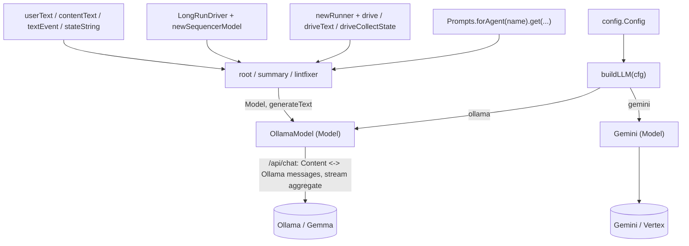

# agent.setup

Shared utilities for building agents.
**This is the only package allowed to import provider SDKs** (the Ollama HTTP client,
ADK-Kotlin's concrete `Gemini` model class, and the `com.google.genai` backend
types) — enforced by the `:konsist` `ArchitectureTest`. The `Model`/`LlmRequest`/
`LlmResponse` abstractions in `com.google.adk.kt.models` are *not* provider SDKs;
agents receive a `Model` directly, mirroring the Go reference's `adk/model.Model`.

## Flow

- `Llm.kt` — `buildLLM(cfg)` / `buildCodeLLM(cfg)`: the provider switch returning a `Model`,
  plus `newGeminiModel`. No `context` argument — ADK-Kotlin is coroutine-based.
- `OllamaModel.kt` — the `Model` adapter over a local Ollama server. ADK-Kotlin
  ships no Ollama model, and there is no official Kotlin client, so the `/api/chat` round-trip
  is implemented directly over **Ktor** (already a dependency). Converts genai content ⇄ Ollama
  chat messages and aggregates streaming chunks. The `HttpClient` is injectable for tests.
- `Generate.kt` — `generateText(llm, system, user)`: a single non-streaming completion.
- `Prompts.kt` — a markdown loader over the classpath (each agent keeps `resources/prompts/<agent>/`).
- `Events.kt` — content/event helpers (`userText`, `assistantText`, `contentText`, `lastText`,
  `textEvent`, `stateString`).
- `Runner.kt` — in-memory runner helpers (`newRunner`, `drive`, `driveText`, `driveCollectState`).
- `Longrun.kt` — generic suspend/resume plumbing: `LongRunDriver` (built on ADK-Kotlin
  **resumability**, `ResumabilityConfig(isResumable = true)` for long-running
  flows) and `newSequencerModel`, a deterministic action→wait `Model` for two-phase
  wait loops. Lives here because it touches the genai types; callers (e.g. `fixflow`) stay
  genai-free.
- `ParkStore.kt` — the durable seam for suspended fix runs: the `ParkStore` interface + `ParkRecord`,
  the in-process `MemoryParkStore` (default), and `newParkStore(cfg)`. The store has single-winner
  claim semantics (`resolveByPrKey`/`sweep`) so exactly one of {CI webhook, soft timer, sweep}
  resolves a run. `ParkStoreSqlite.kt` / `ParkStoreFirestore.kt` are the durable backends
  (`SESSION_BACKEND=sqlite|firestore`); both hand-rolled, since adk-kotlin ships no database store.
- `Session.kt` — `newSessionService(cfg)`: the ADK `SessionService` for the configured backend
  (`InMemorySessionService` / `SqliteSessionService` / `FirestoreSessionService`), holding the
  history a parked run resumes from. `SessionSqlite.kt` / `SessionFirestore.kt` are the durable
  services (also hand-rolled).
- `AdkSerialization.kt` — `adkEventJson`: reflectively reaches adk-kotlin's internal `adkJson` so the
  durable session services round-trip ADK `Event`s exactly as the SDK does (pinned to 0.4.0; fails
  fast at startup if the SDK relocates `getAdkJson`).
- `Names.kt` — `safeName(s)`: derives a safe ADK sub-agent name from a repo/file path (mirrors the Go
  reference's `setup.SafeName`).

Notable idiomatic choices: `Flow`/coroutines drive iteration; errors throw from flows rather than
being yielded; `DriveResult.parkedCallId` is a nullable `String?`; ADK-Kotlin's config carries no
`seed`, so the Ollama options omit it.

Tests stub the Ollama server with a Ktor `MockEngine` and drive the long-running loop with
hand-rolled `BaseTool`s — no real network, no live model. Never assert on LLM output content.
