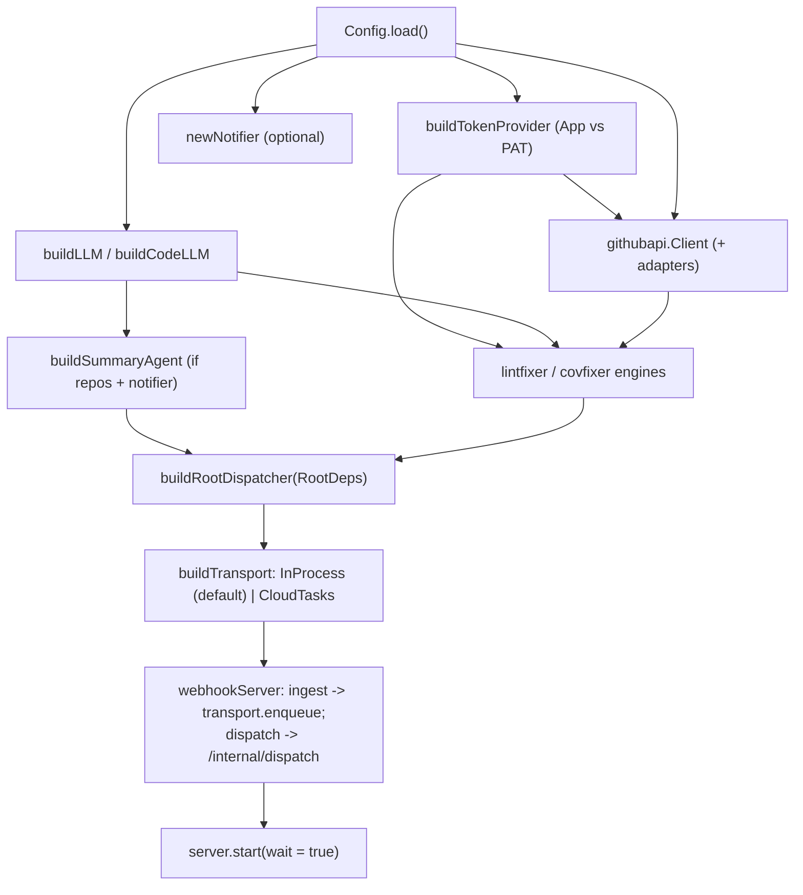

# app

The service entrypoint (`Main.kt`). Composition only — keep it thin; anything testable belongs in
a feature package under `com.automation.agent`.

## Flow

`main()` wires configuration → the model → tooling → the root/summary/fix agents → the
webhook server, then blocks until interrupted. `buildTokenProvider` selects the GitHub auth seam
(`auth.TokenProvider`): App mode (a validated App id, installation id, and exactly one private-key
source) mints/caches installation tokens, otherwise a static PAT (or anonymous). The one provider is adapted to the REST client's `TokenSource`
and the fix engines' git `TokenProvider`, so both share a single cached credential. One `newSessionService` + `newParkStore` pair
(selected by `SESSION_BACKEND`: memory/sqlite/firestore) is built here and shared by both fix
engines, giving them durable suspend/resume. `POST /internal/sweep` is wired to a `SweepFunc` that
calls every engine's `sweepTimeouts` (collect-and-continue across all engines, then rethrow the first
failure so Cloud Scheduler retries). The daily digest is driven by Cloud Scheduler calling
`POST /internal/cron/daily`; the service runs no internal timer. The summary
workflow is enabled only when repositories and a notifier are configured; the fix engines run
without a notifier (they just won't post results). A check_run webhook is handed to every fix engine
— each no-ops unless its check name matches.

Webhooks `enqueue` onto the execution transport (`buildTransport`, selected by `TASKS_BACKEND`): the
**in-process** backend (default, local dev) runs each dispatch on a bounded, drained coroutine pool
with admission backpressure (a burst blocks at the ingest boundary instead of spawning unbounded
coroutines); the **Cloud Tasks** backend (production) hands each envelope to the queue, which POSTs it
to `/internal/dispatch` so the workflow runs **in-request** with durable retry — on Cloud Run's
request-based billing CPU is throttled after the 202, so long LLM compute must run inside a request.
The same `dispatcher.dispatch` backs that worker endpoint. A shutdown hook stops the server, then
`transport.close()` drains in-flight dispatches (the in-process backend; Cloud Tasks closes its
client), then closes the park store's backing connection (`parkStore.close()` — a no-op for the
memory backend). With the memory backend, parked CI-wait runs are abandoned on restart; the durable
backends persist them.

The interactive local REPL lives in the separate [`playground`](../playground/AGENTS.md) entrypoint.
