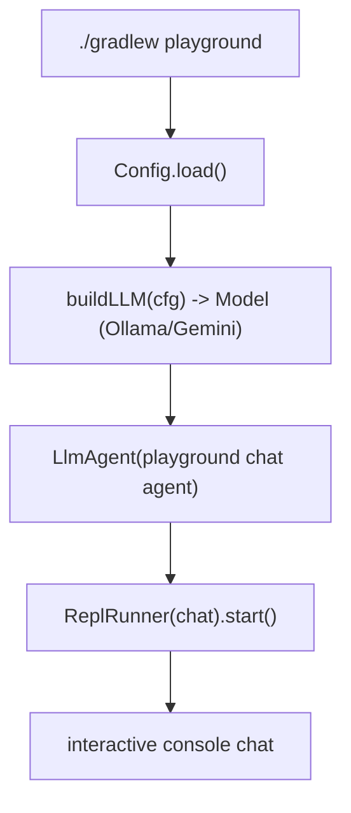

# playground

A local-only entrypoint that launches an interactive REPL to chat with the configured model.
**Development only** — a separate entrypoint from the service (`app.MainKt`), so it is never in a
production artifact, yet still compiled by the normal build so breakage is caught.

## Flow

- `Playground.kt` — builds a simple chat `LlmAgent` over the configured model and runs an
  interactive console via `ReplRunner`. Swap the chat agent for a summary / lint-fixer /
  coverage-fixer agent to drive the real workflows interactively.

A web UI variant would additionally need the `google-adk-kotlin-webserver` dependency (currently
deferred); the console REPL needs only the core SDK.
