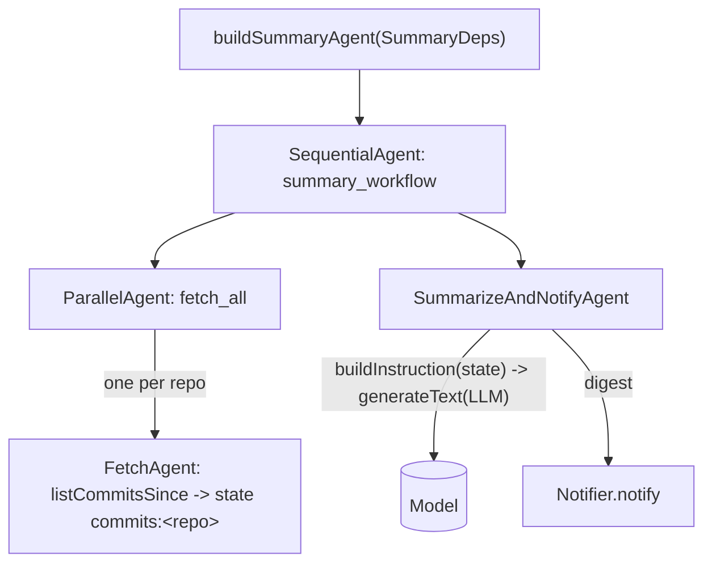

# agent.summary

The daily commit-digest workflow.

## Flow

- `Summary.kt` — `CommitLister` (consumer interface), `FetchAgent` (a custom `BaseAgent` that
  fetches commits and writes `commits:<repo>` to state), and the pure helpers `buildInstruction`,
  `formatCommits`, `firstLine`, `shortSha`, `splitRepo`, `safeName`.
- `SummaryAgents.kt` — `buildSummaryAgent(SummaryDeps)` composing
  `Sequential[ Parallel[fetch×N] -> SummarizeAndNotifyAgent ]`.
- `resources/prompts/summary/summarize.md` — the summarizer prompt (loaded via `Prompts`).

ADK-Kotlin has no `LlmAgent.OutputKey`. Rather than emulate it with a callback, the summarize +
notify steps are collapsed into one `SummarizeAndNotifyAgent` that calls `setup.generateText`
directly and posts the result. The parallel fetch → state → consume structure (the interesting
part) is preserved; deps are non-null by type, so the "required deps" check is a compile-time
guarantee.

Tests use a fake `CommitLister`, a fake `Notifier`, and a stub `Model` (no live LLM); a stub-driven
run exercises fetch + notify and the runner plumbing deterministically. Never assert on LLM output.
