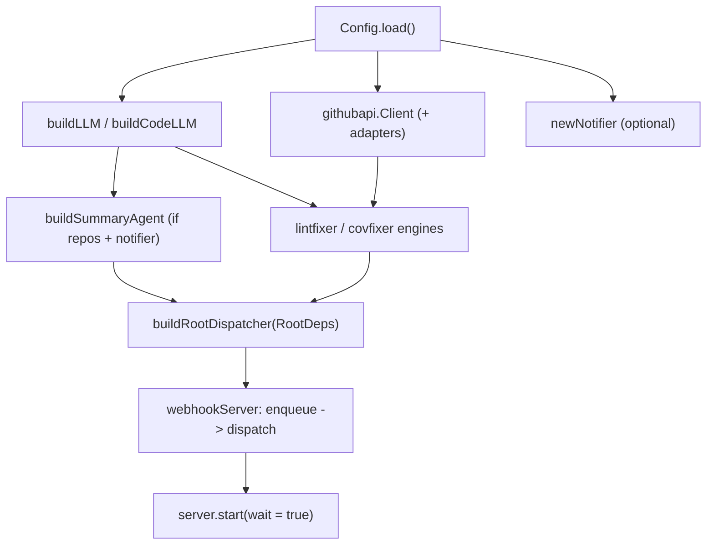

# app

The service entrypoint (`Main.kt`). Composition only — keep it thin; anything testable belongs in
a feature package under `io.github.jkjamies.automationagent`.

## Flow

`main()` wires configuration → the model → tooling → the root/summary/fix agents → the
webhook server, then blocks until interrupted (a shutdown hook drains in-flight dispatches).
The daily digest is driven by Cloud Scheduler calling `POST /internal/cron/daily`; the service
runs no internal timer. The summary
workflow is enabled only when repositories and a notifier are configured; the fix engines run
without a notifier (they just won't post results). A check_run webhook is handed to every fix engine
— each no-ops unless its check name matches.

The interactive local REPL lives in the separate [`playground`](../playground/AGENTS.md) entrypoint.
