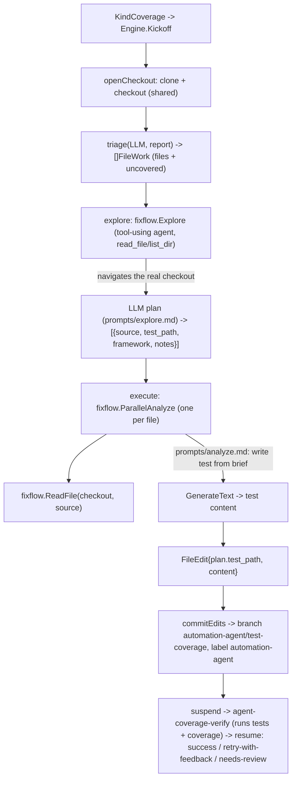

# Coverage Fixer Workflow

The **test-coverage** configuration of the [fixflow engine](/modules/agents/fixflow.md). It triages an agnostic coverage report into source files with meaningful uncovered logic, then generates tests for them. Its prompts are entirely its own — separate from the [lint-fixer](/modules/agents/lintfixer.md)'s — and only the deterministic loop is shared (fixflow).

**Test placement is never derived from a hardcoded rule.** The engine checks the repo out once; an **explorer** examines the repo's *actual* existing tests to plan where each test belongs and which framework to use, and parallel **executors** write the tests from that grounded plan. The explorer is a tool-using LLM agent (`fixflow.Explore`): the model itself navigates the checkout via `read_file`/`list_dir` to gather real test-convention evidence — no engine code pre-selects the files it reads.

## Flow

## Verification loop

Generated tests that don't compile or don't raise coverage are rejected by the `agent-coverage-verify` check and retried with the CI output as feedback — the same loop as the [lint-fixer](/modules/agents/lintfixer.md).

## Implementation layout

- `coverage.go` — `NewEngine(Deps)`: the coverage `Spec` (branch/check + titles); the PR label is one service-wide setting on `fixflow.Deps`, not per-Spec.
- `triage.go` — coverage report → `[]fixflow.FileWork` (files + uncovered regions).
- `analyze.go` — `explore` (a tool-using agent via `fixflow.Explore` grounds a per-file plan in the repo's real conventions) then `execute` (parallel test generation, reading each source with `fixflow.ReadFile`).
- `prompts/{triage,explore,analyze}.md`. The terminal chat summary is assembled deterministically in Go (`fixflow.buildSummaryText`), not by a prompt.

## Testing

Tested with a scripted LLM + a temp checkout; live behavior is gated behind an opt-in environment flag.
