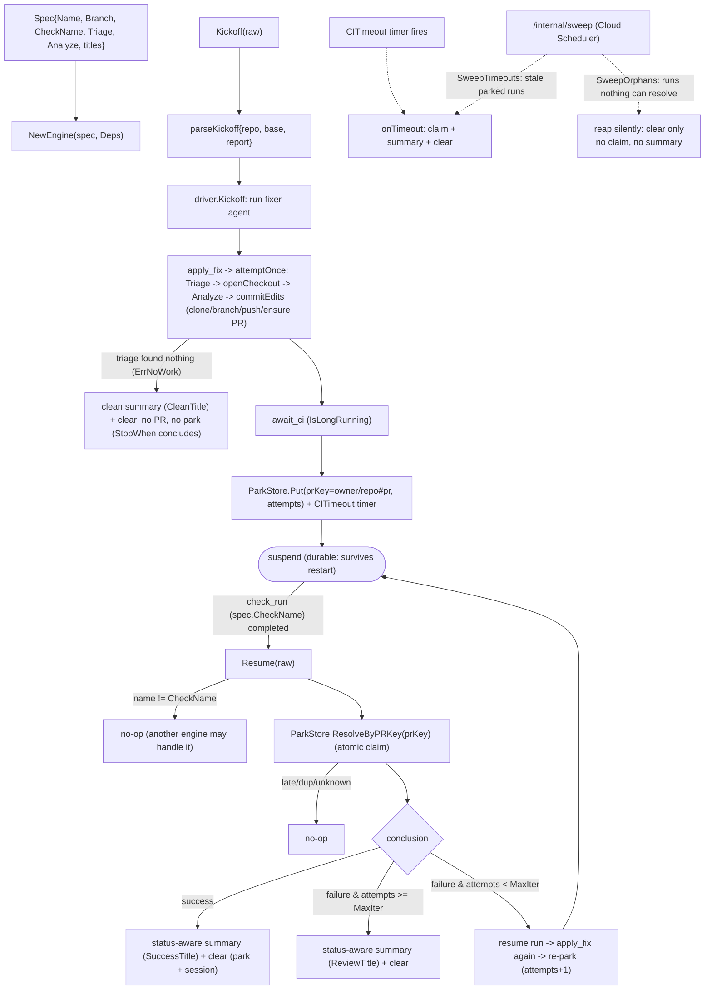

# Fixflow Engine

The reusable engine behind the PR-fixing agents ([lint-fixer](/modules/agents/lintfixer.md), [coverage-fixer](/modules/agents/covfixer.md), …). It owns the event-driven fix loop — kickoff → apply → **suspend across the CI wait** → CI resume → loop or finish — plus the apply mechanics. Each concrete agent supplies a `Spec` (its own triage fn, analyze fn, and branch/check names; the PR label is one service-wide setting on `Deps`) **and its own prompts**; nothing about the LLM prompting is shared here.

## Durable suspend/resume

The CI wait is a real ADK **IsLongRunning** suspend/resume: the `driver` runs a `fixer` agent that calls `apply_fix` then parks on `await_ci`. Both the ADK session and the parked run are persisted through `SESSION_BACKEND` (`memory` | `sqlite` | `firestore`): the run is recorded in the injected `setup.ParkStore` (`ParkRecord` keyed by a UUID session id, with a `owner/repo#pr` `PRKey` index for CI resume). With a durable backend a process restart resumes in-flight runs; the default `memory` backend stays ephemeral (a restart strands them). Attempts are counted in the park record — **not** from GitHub commits.

A run whose CI never reports is freed two ways: a soft per-run `CITimeout` timer (in-process, lost on restart) and the durable `SweepTimeouts` catch-all (driven by `/internal/sweep`). `ResolveByPRKey`/`Sweep` claim a run atomically (single winner), so a late/duplicate webhook racing the timer/sweep resolves it at most once.

Terminal resolution (`clear`) deletes the ADK session (`LongRunDriver.DeleteSession`) and then the park record, so durable backends don't accumulate finished runs. The session goes first: the record is what leads back to it, so a failed session delete keeps the record as a marker the orphan sweep retries rather than stranding a session nothing references. Runs that never reach a terminal path — reclaimed mid-apply, or displaced by a redelivered kickoff — are reaped by `SweepOrphans` on the same `/internal/sweep` schedule, silently.

**Once a run is underway, every terminal path notifies.** Success, retries exhausted, timeout, clean/no-work, an attempt that failed outright, *and* a run whose drive itself failed (the session backend being unavailable, say) all reach a human. This is the reason the failure paths route through one helper rather than returning bare errors: by the time most failures happen the attempt has already pushed a commit and opened a PR, and the dispatcher only logs — so a run dropped without a notification leaves that PR with nobody watching it.

The qualifier is deliberate. A failure *before* the run starts — the kickoff's own `putParams` write failing — returns a bare error and notifies nothing, because nothing has been pushed and there is no PR to leave unattended. Notifying there would be noise about work that never began.

## Workflow graph

The outer loop is a deterministic workflow graph (`Start → apply_fix → await_ci`, with a conditional `failure` cycle back to `apply_fix` and a shared `conclude` terminal), so retry/stop/timeout policy is all in the `driver`, not the graph. The substantive LLM work (triage, exploration, code edits) happens inside the `apply_fix` node → `attemptOnce`.

## Flow

## Implementation layout

- `engine.go` — `Engine` + `Spec` + `Deps` + `FileWork`/`FileEdit`/`AnalyzeInput`; `Kickoff`/`Resume` (delegate to the driver) + `attemptOnce` (one apply attempt).
- `driver.go` — `driver`: the `apply_fix`/`await_ci`/`conclude` workflow nodes, the `fixer` workflow agent (declarative edges, `await_ci` parks via request-input), and the Kickoff/Resume/onTimeout/`SweepTimeouts`/`SweepOrphans` lifecycle over the injected `setup.ParkStore`. Terminal `clear` deletes the ADK session **and then** the park record.
- `summary.go` — `buildSummaryText`: the status-aware terminal summary (success / clean / max-iter / timeout framings) enriched with `GH.Compare` (base...branch diff) + the park record. The clean framing is a workflow-prefixed fun line rotated deterministically by repo.
- `applyfix.go` — clone → branch → commit → push → ensure labeled PR. Whether the branch is
  created or continued is decided by whether the remote already has it, never by a flag the
  caller passes: a redelivered kickoff starts a *fresh* run against a branch a previous
  attempt already pushed, and recreating it from the base would be a non-fast-forward
  rejection every retry repeats identically.
- `analyze.go` — `ParallelAnalyze`: one ADK parallel agent per `FileWork`, distinct state keys so they never collide.
- `envelope.go` — the trusted `{repo, base, report}` kickoff envelope.
- `util.go` — `Engine.Label()`, `ExtractJSONArray/Object`, `StripFences`.

The generic pause/resume plumbing (`LongRunDriver`) lives in the [setup platform package](/modules/agents/setup.md) — it touches the provider SDK (`genai`), which the architecture rules confine to `setup`.

## Multi-engine dispatch

Multiple engines can each be handed a `check_run` event; only the one whose `CheckName` matches acts.

## Testing

Tested with fake triage/analyze + a local seed repo + fakes, driving the real ADK runner through park/resume.
