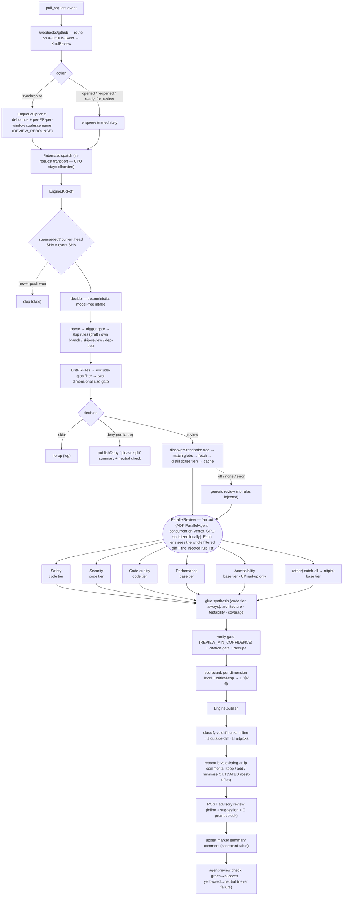

# PR Code-Review Workflow

The in-house **PR code-review** workflow. It reacts to GitHub `pull_request` events and posts a CodeRabbit-style review — per-category sub-agent findings, a count-based scorecard, inline comments with plain-language suggestions, an "🤖 Prompt for AI agents" block, and an **advisory** `agent-review` check (never a merge gate). It is **comment-only** and never opens PRs.

Unlike the lint/coverage fixers, the reviewer is **not** a suspend/resume fix loop: it is mostly one-shot per `pull_request` event and does not park on `await_ci`. Its long LLM compute runs **in-request** via the execution transport (`KindReview` → `/internal/dispatch`), so CPU stays allocated on Cloud Run.

## Flow



## Trigger — native-event kickoff

The reviewer's kickoff is a **native GitHub event** (`pull_request`), not a custom POST route. The GitHub App delivers it to the single `/webhooks/github` URL, where the handler routes by the `X-GitHub-Event` header (`pull_request` → `KindReview`, `check_run` → `KindCI`). This is a third door alongside the fixers' custom-route kickoff and native `check_run` resume — see [webhooks](/standards/webhooks.md).

## Coalesce-to-latest — debounce + staleness

Rapid pushes to one PR are collapsed so only the latest SHA is reviewed (two parts, because Cloud Tasks gives no ordering and cannot cancel an in-flight task):

- **Debounce at enqueue** (`enqueue.go`, `EnqueueOptions`): a `synchronize` review is enqueued with `REVIEW_DEBOUNCE` delay under a per-PR-per-window Cloud Tasks dedup name, so a burst of pushes collapses to one delayed task. The name carries a time bucket (receipt time floored to the debounce window) so a push minutes later doesn't collide with Cloud Tasks' ~1h name reservation and get silently dropped. `opened`/`reopened`/`ready_for_review` enqueue immediately. This is a workflow concern, so it lives here, not in the transport. Only the Cloud Tasks backend honors the hints (and it is the backend, not this layer, that treats a duplicate name as a successful coalesce rather than an error).
- **Staleness at execution** (`Kickoff` → `superseded`): the engine fetches the PR's current head SHA and skips if it no longer matches the event's SHA (a newer push won). Best-effort — a lookup error proceeds rather than suppressing a real review.

  This is checked at **every stage boundary**, not once — and which boundaries exist depends on the decision:

  - **Review** has four: at intake, after standards discovery, after the lens fan-out (before glue), and again before publish.
  - **Deny** has one, and that is not an omission. Intake sits immediately before `publishDeny` with nothing between them but a struct literal, so there is no expensive stage to guard. A second lookup there would *widen* the exposure rather than narrow it: `superseded` is itself a GitHub round-trip, so its answer is already up to that round-trip old when it returns — a check costing ~100 ms to close a window measured in nanoseconds.

  Debounce and the intake check together cover the *queue* window, but a review takes minutes, so a push can easily land while one is already running — and then the two are concurrent, on different SHAs. That is the gap the later review-path checks exist for, and it is why the deny path does not need them.

  The last check is the one that matters for correctness. A superseded run must discard its own output rather than post it: the summary comment's marker is keyed **per PR, not per SHA**, so a slower older review would overwrite a newer one's scorecard, and its reconciliation pass would minimize the newer review's inline comments as **OUTDATED**. `alreadyPublished` cannot prevent this — it keys on the head SHA, and two concurrent reviews have different SHAs by construction, so it only ever guarded a redelivered task for the *same* SHA.

  The earlier checks are compute savings, and they are not free money: a doomed run holds `LLM_MAX_CONCURRENT` slots that the review which *will* publish is queued behind. Losing the race before the fan-out skips the fan-out entirely.

  The checks sit at stage boundaries rather than inside each lens deliberately. The lenses run concurrently, so a per-lens check would ask GitHub the same question N times at the same instant and still could not stop the calls already in flight; the boundary is the only place the answer changes the outcome. True mid-fan-out preemption (a poller cancelling the context) is deliberately not built — it needs a background goroutine per review plus disambiguating "cancelled because superseded" from "cancelled because the dispatch deadline expired", and the stage checks get most of the benefit.

**Incremental re-review** (re-evaluating only the files changed since the last reviewed SHA) is intentionally **not** built: GitHub-as-store persists rendered comments, not structured findings, so the latest SHA is always reviewed in full and reconciled against the existing comments.

## Data layer — REST-first (GraphQL reserved for reconciliation)

The reviewer reads the PR and posts its output via the **GitHub REST API**, over the shared `auth.TokenProvider` (App installation token in production, PAT locally — no auth work here):

- **Read:** changed files **and patches** via `GET /pulls/{n}/files` (paginated); file content at the head SHA via `githubapi.GetFileContent`; PR metadata, labels, and check runs via REST.
- **Write:** the review (`POST /pulls/{n}/reviews` — inline comments + prose suggestions), the marker summary comment (issue comments), and the `agent-review` check run.
- **The `agent-review` check is REST-only** — GitHub's GraphQL API has no check-run mutation, so there is no GraphQL path for it by design.

### Reconciliation — GitHub-as-store (no local durable state)

Re-reviewing a PR is **idempotent and self-cleaning** without a local store: every inline comment carries a hidden fingerprint marker `<!-- ar-fp:<file:line:normalizedMessage> -->`, so GitHub itself holds the per-PR review state. On each publish (`reconcile.go` + `publish.go`):

- **list** the PR's existing review comments (`ListReviewComments`, REST) and parse their markers;
- **keep** a finding already represented by a comment (not re-posted → idempotent);
- **add** a finding with no existing comment (posted with its marker);
- **minimize** an existing fingerprinted comment whose finding is gone — collapsed as **OUTDATED** via `MinimizeComment` (the **only GraphQL** in the codebase: a raw mutation to `<BaseURL>/graphql` over the same `TokenProvider`, since the REST API has no minimize/resolve). Comments without our marker (foreign, or pre-reconciliation) are ignored.

Minimization is **best-effort**: it runs after the new inline comments are posted but a single `MinimizeComment` failure only logs and continues so the summary comment and check run still publish (a leftover stale comment is collapsed on the next genuine re-push). Reconciliation keys purely off the hidden `ar-fp:` marker and does **not** filter by comment author: at a single deployment every marked comment is one this agent posted, so closing-its-own-fixed-comments holds without identity resolution. Author/thread-identity awareness is deferred to a future reply-to-reply feature (which inherently needs to know which thread is the agent's and who replied); the cheap marker-scoping fix covers the only residual case (two deployments sharing one repo) if it ever becomes real.

This replaced the publish stage's coarse whole-SHA skip **for inline comments only**. The `alreadyPublished` head-SHA guard still protects the non-comment outputs — the summary comment, the `agent-review` check run, and the `publishDeny` path — from duplicating on a redelivered task (a genuine re-push carries a new SHA and reconciles normally). The read-aggregate path may move to GraphQL if volume justifies it; patches stay REST (GraphQL cannot return diff hunks; `createCheckRun` is also REST-only).

## Intake pipeline

`Engine.Kickoff` runs a deterministic, model-free intake before any review work and produces a `decision` (skip / deny / review):

1. **Parse** the event (`githubapi.ParsePullRequestEvent`).
2. **Trigger gate** — only `opened` / `reopened` / `synchronize` / `ready_for_review` proceed.
3. **Skip rules** — draft (unless `ready_for_review`, `REVIEW_SKIP_DRAFTS`), the agent's own `automation-agent/*` branches, the `skip-review` label, and dependency-bot authors (`dependabot[bot]` / `renovate[bot]`).
4. **Fetch** the changed files + patches (`githubapi.ListPRFiles`, REST, paginated).
5. **Filter** generated/vendored/lockfile/minified/binary paths (`REVIEW_EXCLUDE_GLOBS`); size is computed on the **filtered** set. An empty filtered diff skips.
6. **Size gate** — two-dimensional (`REVIEW_MAX_FILES` **and** `REVIEW_MAX_DIFF_BYTES`): over either cap denies (review-or-deny, no degrade tier). The byte cap **defaults from the provider**, because the two backends fail differently: locally it is derived from `OLLAMA_NUM_CTX` (half the window, leaving room for the lens prompt, the standards menu, and the model's own findings — all of which share that window), since the adapter sends `Truncate=false` and an oversized prompt is a hard error rather than a degraded review. On a hosted model the window is not the binding constraint, so the cap is a fixed, much larger figure chosen for review usefulness and cost. An explicit env value overrides either.

When the decision is **review**, the model-calling stage runs (see below) and its result is published; when it is **deny**, the "too large" summary + a neutral check are published.

## Review stage (category fan-out → glue → scorecard)

When intake returns `review`, `Engine.review` runs the model-calling stage:

1. **Fan out** one agent per applicable category over the **whole filtered diff**, in parallel (ADK `ParallelAgent` — concurrent on Vertex, GPU-serialized locally). The consolidated set: Safety + Security + Code quality (code tier), Performance + Accessibility (base tier; accessibility only when UI/markup files changed) + an `(other)` catch-all whose findings are demoted to nitpick.
2. **Glue/synthesis** (code tier, always) runs over the diff + the category findings and adds the cross-cutting lenses: architectural alignment, testability, test coverage.
3. **Verify gate + citation gate + dedup** (deterministic, in code — not asked of the model): drop findings below `REVIEW_MIN_CONFIDENCE`; apply the standards citation gate (below); then collapse cross-lens duplicates by fingerprint (keep worst severity).
4. **Scorecard**: a per-dimension severity histogram → level (🔴 any critical or ≥2 major · 🟡 any major or ≥3 medium · 🟢 else); overall = critical-cap (any critical in security / runtime safety → 🔴) combined with the worst dimension level. Count-based — no synthetic 0–100 score.

### Per-event text is never templated

Every reviewer agent — the category lenses, glue, and the standards distiller — receives its instruction through `setup.StaticInstruction`, an `InstructionProvider` that returns the composed string verbatim, never through the ADK's plain `Instruction` field. The ADK treats that field as a template: each `{identifier}` is a session-state lookup that fails the run with "state key does not exist" when the key is absent. The diff and the standards docs are foreign text that routinely contains exactly that shape — a Python f-string, a `/repos/{owner}/{repo}` route, a templated config — so on the templated path a single such line would error the whole review (or silently degrade a distillation to generic). The provider path is exempt from templating, which is the same reason the [summary](/modules/agents/summary.md) workflow drives its summarizer through a provider.

### Scorecard and lens table agree by construction

The summary shows two groupings of the same findings: the **scorecard** (per dimension) and the **lens status table** (per lens — each category agent and the glue pass). They cannot drift because the lens grouping is derived from the dimension grouping, never computed separately:

- Each lens **owns** a fixed set of dimensions (`category.dims`, and `glueLens` for the synthesis pass) — exactly the values its prompt allows a finding to carry. Every known dimension belongs to exactly one lens, and tests assert that both against the code and against each prompt's `"dimension"` schema line, so a prompt edit that adds a dimension fails the gate until a lens owns it.
- A lens's **level** (`lensLevel`) is the worst scorecard level among the dimensions it owns, read from the same per-dimension levels the scorecard table renders. A finding is therefore credited to the lens that owns its dimension whichever agent emitted it (a lens that strays outside its prompt's dimensions is scored where the finding belongs, not where it came from), and cross-lens dedup — which keeps one finding per fingerprint regardless of lens — leaves both tables consistent.
- The header's actionable count, the collapsible sections, and the scorecard total describe one set: `classify` partitions the gated findings into inline / outside-diff / nitpick with nothing dropped, and a test pins the partition to the scorecard total.

The lens table also carries what each lens cost. `setup.DriveReport` attributes every non-partial event of a drive to its author agent — wall time from the start of the drive to the agent's last event (for the parallel fan-out this includes any wait for a model concurrency slot: it is the time the lens took as experienced, not model time), the token usage the model reported (`UsageMetadata`, which the Ollama adapter maps from the server's `prompt_eval_count` / `eval_count` and the Gemini adapter reports natively), and the model version the response named, falling back to the configured model's name. The table lists every lens, including one the diff did not select (the UI-only accessibility lens on a non-UI diff, marked **skipped**) — unlike the scorecard, which lists only dimensions with findings — so a reader sees what the review consisted of, not just what it found. A lens that produced no output at all is marked **no output** rather than reading as clean; token cells show `–` when the model reported no usage, which is not the same as zero.

## Standards-aware review — steer off the reviewed repo's own conventions

The reviewer steers off the conventions of the **repo under review** — `.agents/standards`, `.cursor/rules`, `CLAUDE.md`, `CONTRIBUTING.md`, linter configs, whatever that repo has — **not** the automation service's own. All **API-only** (no clone). In `standards.go`:

1. **Discover** (`discoverStandards`): list the reviewed repo's tree at the head SHA (`githubapi.Tree`) and match it against the `REVIEW_STANDARDS_GLOBS` (format-agnostic; default covers the common AI-assistant + project conventions), then fetch the matched docs (`GetFileContent`, capped by `REVIEW_STANDARDS_MAX_BYTES`).
2. **Distill** (the base-tier model — distillation is summarization, the base tier per the model-size split): `buildDistillerAgent` feeds the discovered docs (heterogeneous formats) to the base model, which emits **one uniform tagged rule list** `[{id, dimension, summary, source}]` (`prompts/distill.md`, parsed defensively by `parseRules`).
3. **Cache** per repo + docs revision (`standardsCache`, keyed on the matched blob SHAs): a hit reuses that revision's distilled list rather than re-distilling per review. Two things cause a miss — a standards edit, which changes the key, and eviction, which can drop a still-current entry. The cache is a small **LRU** (32 entries): each entry holds the full text of the discovered docs (up to `REVIEW_STANDARDS_MAX_BYTES`), and because the key includes their blob SHAs, every edit to a repo's conventions mints a new entry and strands the old one — unbounded, that grows with how often the org edits its standards, not with how many repos it has. Recency is the right eviction order because PRs arrive in bursts per repo; a miss costs one base-tier model call, so evicting early is cheap.
4. **Inject** the compact rule list into **every** category + glue lens (`writeStandardsMenu`) — no per-lens routing; the list is small and the narrow lens prompt focuses it. Full rule text is available on demand via the lazy **`get_rule(id)`** tool (`standardsTools`, same pattern as the fixers' `read_file`), so deep detail never sits in context unprompted.
5. **Citation gate** (`gateCitations`, `REVIEW_UNCITED_MODE`): a conformance-dimension finding (`pattern_violation` / `architectural_alignment`) that cites no real injected `rule_id` is **dropped** or **demoted to nitpick** — so a "violation" only carries full weight when anchored to one of the repo's own documented rules. Other dimensions (e.g. security) need no citation.
6. **Report**: the summary's *Review details* lists the applied standards source paths, or "generic" when none were found.

Graceful by design: standards off, no docs found, or a distillation/fetch error all degrade to a **generic** review (best-effort). The reviewer stays **out of the mechanizable lint layer** — it is no-clone, so it does **not** run the repo's linters (the repo's own CI owns that); it spends its LLM budget on the judgment conventions a linter can't check.

## Publish stage (CodeRabbit-style, advisory, all REST)

`Engine.publish` posts the scored review; nothing here gates a merge:

1. **Classify** the gated findings against the diff hunks (`hunks.go`): actionable (critical/major/medium) findings on a commentable head-side line post **inline**; actionable findings outside the diff are listed in the summary's **🔭 Outside diff range** section (never dropped or snapped to a wrong line); nitpicks collapse into **🧹 Nitpicks**.
2. **Inline comments** carry an icon+category prefix (`🔒 Security` / `⚠️ Potential issue` / `🛠️ Refactor`), an optional plain-language **Suggestion** line, and an optional collapsible **🤖 Prompt for AI agents** block (`fix_prompt`), posted as one advisory `COMMENT` review **pinned to the reviewed head SHA** (`commit_id`). The pin matters because every line number came from that SHA's diff: unpinned, GitHub resolves the lines against whatever HEAD is current when the call lands, so a push arriving mid-review anchors comments to the wrong lines or `422`s the whole call — and publish aborts on the first error, so the summary comment and the check would go down with it. Staleness detection at kickoff narrows this window but cannot close it; the pin does.
   The suggestion is **prose, never a GitHub ```suggestion block**. That block is a one-click commit of a verbatim replacement for the commented lines, and the lenses cannot author one reliably: they see a unified diff with no surrounding file, so a snippet rarely aligns with the exact lines it would replace — and the model's "snippet" is often itself a sentence, which the block would offer to commit as source. A sentence saying what to change is what a reader can act on with the context they have; the fenced fix prompt is the hand-off for an agent that does have the file. Being prose, it goes through the same @mention / HTML sanitizing as the message.
3. **Reconcile** against the PR's existing fingerprinted comments (see *Reconciliation* above): skip findings already posted (idempotent), post only new ones, and minimize comments now fixed.
4. **Summary comment** is marker-updated (`<!-- automation-agent:review:<owner>/<repo>#<n> -->`) so a re-review edits it in place: header + scorecard table + the collapsible sections + review details (head SHA, file count, standards applied, and the per-lens status table — one row for **every** lens, the six categories and the glue pass, with its level, the model it ran on, wall time, and tokens in/out; a lens the diff did not select is listed as skipped rather than omitted, whereas the scorecard lists only the dimensions that received findings).
5. **`agent-review` check** (advisory): green → `success`, yellow/red → `neutral` — **never** `failure`. Deny publishes the "too large, please split" summary + a neutral check.

### Structured output on the local model path

Category agents deliberately do not set `OutputSchema` — schema validation fails the run on a malformed body, while the design wants malformed → no findings — and the local-model adapter only forwards generic JSON mode via `ResponseMIMEType`. So category agents request `application/json` (valid JSON syntax), describe the exact findings schema in their prompt, and `parseFindings` recovers **defensively** — it scans the model text for the first JSON array that yields a *usable* finding, tolerating fences/prose, and treats a malformed body as no findings (empty = success). "Usable", not merely "decodable", is load-bearing: JSON ignores extra fields, so an unrelated array of objects — a lens prefacing its findings with `[{"path":"a.go"}]` — decodes perfectly into all-zero finding records. Committing to that array would leave every element message-less, so the lens would report nothing and the review would call the code clean. Requiring a usable element makes such an array simply not a match. (`parseRules` already worked this way.) This is best-effort by design; the narrow single-lens prompts are themselves the false-positive control, and the model is a config knob.

## Implementation layout

- `reviewer.go` — `Deps`, `Engine`, `NewEngine`, `Engine.Kickoff(ctx, raw)`, and the `decide` intake orchestration + skip helpers. Gated by `REVIEW_ENABLED` (default false, the kill switch).
- `filter.go` — the exclude-glob `fileFilter` (basename and `**`-aware path globs) that drops generated/vendored/binary churn and totals the filtered patch bytes.
- `sizegate.go` — `oversize`, the two-dimensional file-count/diff-byte cap.
- `findings.go` — the `finding` schema, severity/dimension normalization, `fingerprint`, and the defensive `parseFindings`.
- `categories.go` — the consolidated category set, each lens's owned dimensions (`dims`), the `glueLens` descriptor, and `selectCategories` (UI-only gating).
- `scorecard.go` — the count-based `scoreFindings`, and `lensLevel` (a lens's level derived from its owned dimensions' scorecard levels).
- `glue.go` — the deterministic verify gate + cross-lens `dedupe` the glue pass owns.
- `review.go` — `Engine.review`: the fan-out drive (`ParallelReview`), glue drive, and diff formatting. Returns the scorecard, the gated findings, and one `lensStat` row per lens (model, wall time, tokens, whether it produced output) for the publish stage.
- `hunks.go` — `commentableLines` / `diffIndex.inDiff`: which head-side lines of a patch GitHub accepts an inline comment on (added/context lines), used to route in-diff vs out-of-diff.
- `publish.go` — `Engine.publish` / `Engine.publishDeny`: the CodeRabbit-style assembly + REST writes (advisory review, marker summary comment, advisory `agent-review` check).
- `reconcile.go` — the fingerprint marker (`fpMarker`/`parseFPMarker`) and the pure `reconcile`: given this run's inline findings + the PR's existing comments, what to post vs minimize.
- `standards.go` — standards-aware review: discovery (`matchStandards`), the distiller orchestration + defensive `parseRules`, the per-repo `standardsCache`, the rule menu / lazy `get_rule` tool (`standardsTools`), and the `gateCitations` citation gate.
- `enqueue.go` — `EnqueueOptions`: the debounce/coalesce transport hints for a synchronize review.
- `agents_setup.go` — the build-agent split: pure ADK wiring (category + glue + distiller LLM agents, the prompt embed, the JSON `GenerateContentConfig`), every instruction handed over via `setup.StaticInstruction`. Logic lives in the files above.
- `prompts/*.md` — one markdown prompt per category, the glue pass, and the standards distiller.

The `pull_request` webhook parse (`ParsePullRequestEvent`) and the file fetch (`ListPRFiles`) live in the GitHub API tooling layer (`githubapi`) next to `ParseCheckRunEvent`, so the provider SDK stays in the tooling layer and the reviewer consumes stable projections — no GitHub SDK import here.

## Wiring

The [root dispatcher](/modules/agents/root-dispatcher.md) registers `KindReview` → `Engine.Kickoff`; the command layer builds the engine (via `NewEngine`) from config and injects the `githubapi` client. Provider SDKs stay out via [setup](/modules/agents/setup.md) helpers. Tests are deterministic glue only — no assertions on LLM output.
