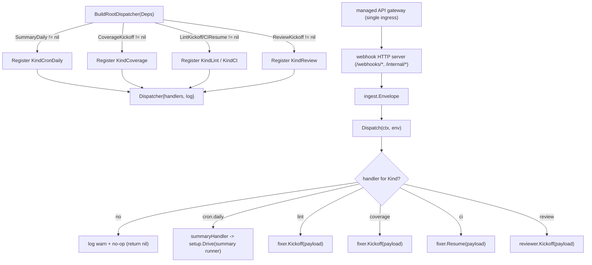

# Root Dispatcher

The dispatcher kicked off for every ingest, following the build-agent pattern: a builder function wires the dispatcher from injected dependencies, registering a workflow handler only when that workflow's dependencies are present.

## Flow

## Behavior

- The `Dispatcher` routes an `ingest.Envelope` to a `Handler` by `Kind`. Unregistered kinds are logged and ignored, so a not-yet-wired ingress is a no-op rather than an error.
- `BuildRootDispatcher(Deps)` registers the available workflows when their dependencies are present:
  - `KindCronDaily` → the [summary workflow](/modules/agents/summary.md). Its runner is built **per fire**, not once at registration: the runner owns the in-memory session service behind it, so a retained one would retain every fire's session for the life of the process — a daily digest of every configured repo, stranded once a day and never reclaimed. A runner is still built once at registration and discarded, purely so a misbuilt agent tree fails startup rather than first surfacing on a cron fire hours later. Because each fire brings its own session service, the session id is a constant: two concurrent fires cannot collide, and a regression back to a retained runner shows up as the second fire inheriting the first's state instead of leaking silently.
  - `KindCoverage` → the [coverage-fixer](/modules/agents/covfixer.md) kickoff.
  - `KindLint` / `KindCI` → the [lint-fixer](/modules/agents/lintfixer.md) kickoff / resume.
  - `KindReview` → the [PR code-review agent](/modules/agents/reviewer.md) kickoff (`ReviewKickoff`).

Keeping a single entry point is the point of "root": new ingress sources (GitHub / Jira / Confluence / human) and smarter routing (e.g. LLM-based) slot in here without restructuring. Today it is a deterministic dispatcher; it can become an ADK agent when LLM routing is wanted.

## Implementation layout

- `root.go` — `Dispatcher`: routes an `ingest.Envelope` to a `Handler` by `Kind`; unregistered kinds are logged and ignored.
- `agents_setup.go` — `BuildRootDispatcher(Deps)`: conditional registration of the summary, coverage-fixer, lint-fixer, and reviewer handlers.

## Testing

Tested directly (routing, unhandled no-op, error propagation) plus a build test that drives a real runner with a trivial stub agent — no LLM needed.
