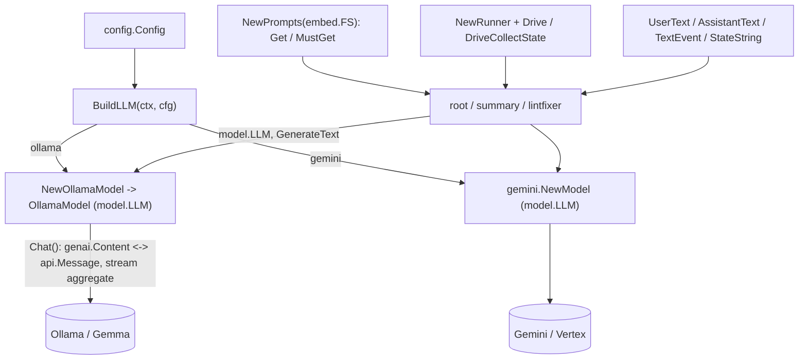

# Agent Setup Platform Package

Shared utilities for building agents. **This is the only package allowed to import provider / infrastructure SDKs** — the LLM providers (Ollama, Gemini, genai) **and** the durable session/park backends (ADK database sessions, sqlite, Firestore) — enforced by architecture tests (see [architecture design](/standards/architecture-design.md)).

It owns three provider-switched seams, each built once at startup: the LLM (`BuildLLM`), selected by `LLM_PROVIDER` (`ollama` | `gemini`); and the ADK `session.Service` (`NewSessionService`) plus the `ParkStore` (`NewParkStore`), both selected by `SESSION_BACKEND` (`memory` | `sqlite` | `firestore`).

## Why one builder, two providers

Local development runs free and offline on Ollama + Gemma; production runs Gemma
through the native Gemini client on Vertex (a trivial env override targets AI Studio
instead), so there is no GPU VM to operate and the model scales to zero with the
service. A proxy or compatibility shim between the app and the model was rejected: it
adds a hop and a deployment, and translates tool calls lossily, while the `BuildLLM`
seam already makes switching providers a config change rather than a code change.
Model sizing splits by task: code reasoning and code changes use the larger code model
(`OLLAMA_CODE_MODEL`); summarization and lighter reasoning use the base model
(`OLLAMA_MODEL`). The default tags live in one place — `config.DefaultOllamaModel` /
`DefaultOllamaCodeModel` — because a tag is a moving target (a family gets a new generation, a
size is renamed, a tag is withdrawn) and it previously appeared in the loader, three packages'
live tests, `.env.example`, and the docs.

`VerifyOllamaModels` makes a stale tag legible: `NewOllamaModel` only builds a client, so a tag
that was never pulled constructs fine and first fails on the initial generation — after a webhook
was accepted, a task dispatched, and a repository cloned, where it reads as an opaque drive error
rather than "that model isn't here". The service lists the server's models once at startup
instead and warns, naming the tag, the `ollama pull` that fixes it, and what the server does
have. **Advisory only** — configuring the deployment is the operator's job and this never decides
whether the process boots, which is also why the error carries its whole explanation in the
message rather than in a sentinel: nothing branches on which failure it was. Skipped entirely
under `LLM_PROVIDER=gemini`.

## Flow

## Implementation layout

- `llm.go` — `BuildLLM(ctx, cfg)`: the provider switch returning a `model.LLM`.
- `ollama_preflight.go` — `VerifyOllamaModels(ctx, host, tags...)`: the advisory startup check that the configured tags are pulled. Returns a self-explanatory error the caller logs; Ollama's implicit `:latest` is normalized on both sides so a bare name does not read as missing.
- `ollama.go` — `OllamaModel`, the `model.LLM` adapter over the official Ollama client. Converts genai content ⇄ Ollama chat messages and aggregates streaming chunks. The ADK ships no built-in Ollama model, so this adapter provides one.
- `gemini.go` — the Gemini-backed `model.LLM` for the cloud deployment.
- `prompt.go` — `Prompts`, a markdown loader over an embedded filesystem (each agent embeds its own `prompts/` dir).
- `events.go` — small genai content helpers (`UserText`, `ContentText`, `LastText`).
- `runner.go` — runner helpers (`NewRunner` over an in-memory session for the ephemeral explore/analyze/root runs, `Drive`, `DriveText`, `DriveCollectState`).
- `longrun.go` — generic workflow **pause/resume** plumbing: `LongRunDriver` (`Start`/`Resume` returning a plain `DriveResult`, over an injected `session.Service`; `DeleteSession` for terminal cleanup). Drives a parking workflow agent to its request-input pause and feeds the real result back; node outputs are attributed via the `NodeOutputKey` tag. Lives here because it touches `genai`; callers (e.g. the [fixflow engine](/modules/agents/fixflow.md)) stay genai-free.
- `session.go` — `NewSessionService(ctx, cfg)`: the durable suspend/resume **history** backend switch (`memory` = the in-memory service; `sqlite` = the ADK database session service; `firestore` = `session_firestore.go`).
- `session_firestore.go` — a hand-rolled Firestore `session.Service` (the ADK ships none for this stack). Five methods with `app:`/`user:`/`temp:` state scopes; validated against the ADK's own session-service conformance tests via the Firestore emulator.
- `parkstore.go` / `parkstore_sqlite.go` / `parkstore_firestore.go` — the `ParkStore` interface + `ParkRecord` and its `memory` / `sqlite` / `firestore` backends. The park record (prKey→session, attempts, serialized run params) that a CI webhook needs to resume the right run; atomic single-winner `ResolveByPRKey`/`Sweep`. `NewParkStore(ctx, cfg)` selects the backend.
- `durable_resume_test.go` — proves cross-process resume; conformance suites cover all three park/session backends (Firestore behind `FIRESTORE_EMULATOR_HOST`).

## Testing

Tests stub the Ollama HTTP server and use an in-memory filesystem for prompts — no real network, no live model. Tests never assert on LLM output content.
