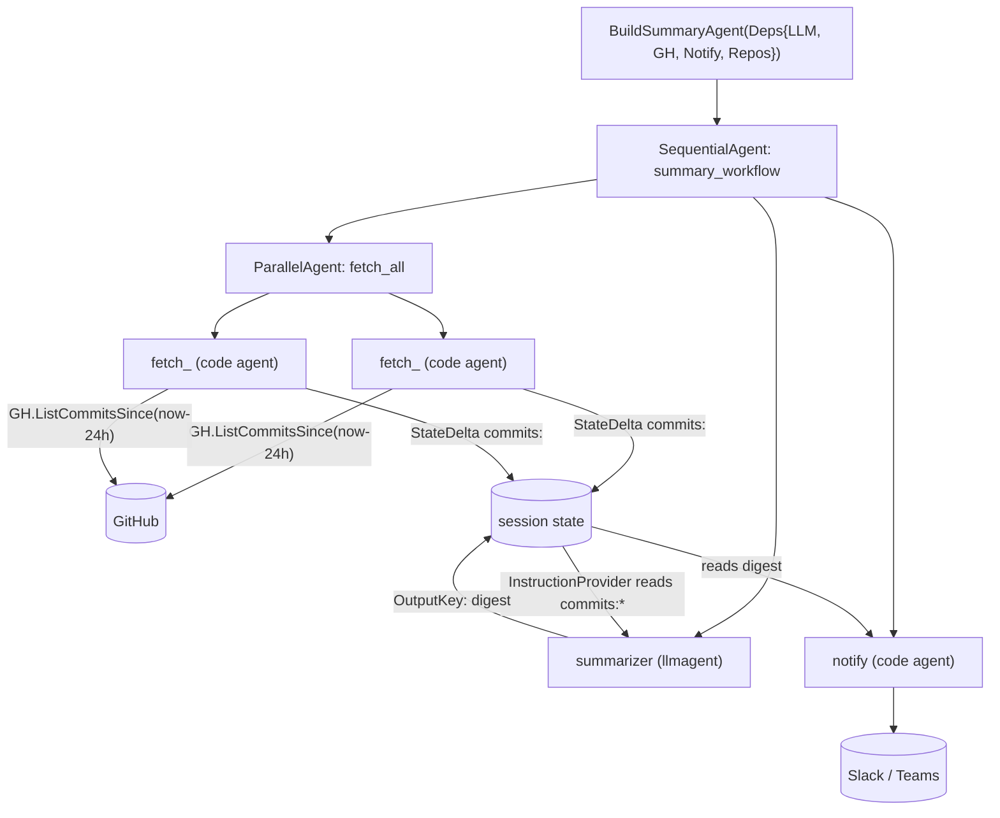

# Daily Summary Workflow

The summary workflow agent, following the build-agent pattern: a builder function does the pure ADK wiring while the testable logic lives in plain functions.

## Flow

## Structure

- `BuildSummaryAgent(Deps)` wires `Sequential[ Parallel[fetch×N] -> summarize(LLM) -> notify ]`. Pure wiring, no logic.
- The testable logic — per-repo fetch code-agents, the notify code-agent, `formatCommits`, and the summarizer's `InstructionProvider` — lives in plain functions separate from the wiring.
- The summarizer instruction is a markdown prompt (`prompts/summarize.md`), embedded in the binary.

## Data flow

Each parallel fetcher writes its repo's commit digest to session state under `commits:<owner/repo>`. The summarizer's instruction provider reads all `commits:*` keys, appends them to the prompt, and the model writes the digest to state under `digest` (its `OutputKey`). The notifier reads `digest` and posts it to chat.

## Reference implementation layout (Go port)

The same structure exists in each port; the Go port is the reference.

- `agents_setup.go` — `BuildSummaryAgent(Deps)`: the sequential/parallel ADK wiring.
- `summary.go` — the testable logic: per-repo fetch code-agents, the notify code-agent, `formatCommits`, the summarizer's `InstructionProvider`.
- `prompts/summarize.md` — the summarizer instruction (markdown, embedded).

## Testing

`CommitLister` is a consumer-defined interface over the GitHub API tooling layer (fakeable). Tests cover the deterministic helpers and structure; a live-gated test runs the whole workflow end-to-end against a real model. Tests never assert on LLM output content.
