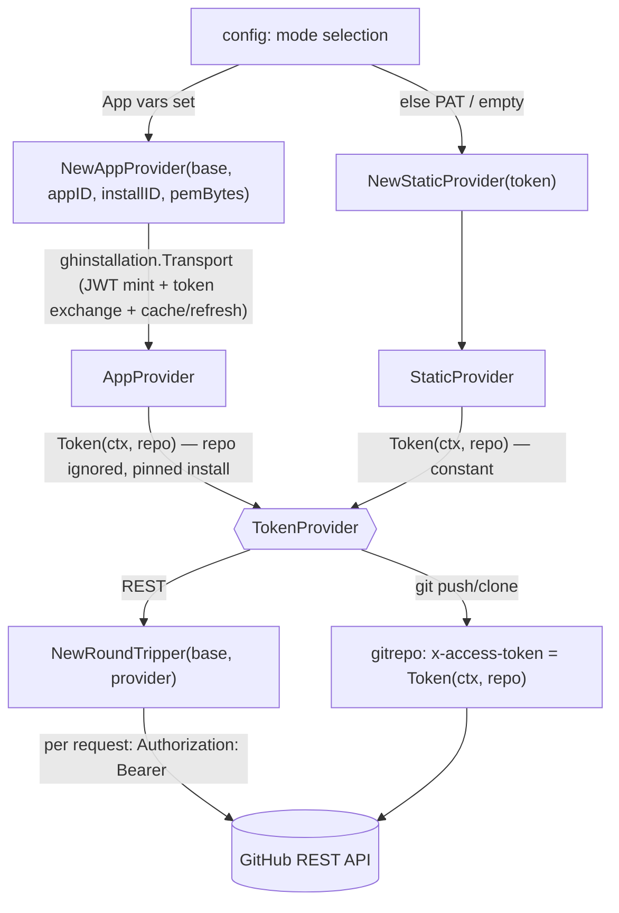

# GitHub Authentication

The GitHub authentication seam. One interface, `TokenProvider`, hides whether a
token comes from a static PAT (local-dev fallback) or a freshly minted GitHub App
installation token (production).

## Flow

- `TokenProvider.Token(ctx, repo)` — the seam. `repo` is `"owner/name"`. PAT mode
  returns the same constant for every repo; App mode mints/caches a short-lived
  (~1h) installation token and refreshes it before expiry. The seam is the
  contract; the library behind it is an implementation detail.
- `StaticProvider` — constant token. Backs the PAT fallback and the empty
  (anonymous, public-read/test) client. An empty token is valid.
- `AppProvider` — wraps `ghinstallation/v2.Transport`
  pinned to **one** installation id — a deliberate design constraint: each
  deployment serves a single GitHub org/installation — so there is no
  per-owner cache and no dynamic `repo→installation` resolution. The `repo`
  argument is accepted for the contract but ignored. `withBaseURL` overrides the
  token-exchange and identity endpoints for tests.
- `AuthoredLogin` (the optional `IdentityResolver`) — resolves the login this deployment
  authors content as: `<app-slug>[bot]` via a JWT `GET /app` in App mode, the user login via
  `GET /user` in PAT mode, `""` when anonymous. It is what lets the reviewer recognize its own
  comments. Both providers take a base-URL override (`withBaseURL` / `withStaticBaseURL`) so
  either lookup can be pointed at a stub — the two are the same operation in the two auth
  modes, and neither should need github.com to be tested.
- `NewRoundTripper(base, provider)` — bridges the seam to the GitHub REST client
  (see [githubapi](/modules/platform/githubapi.md)): it injects
  `Authorization: Bearer <token>` on a clone of each request (an empty token is
  left unauthenticated). The provider's cache means this stays cheap.

## Why an App, and why one pinned installation

A PAT is a broad, non-expiring credential tied to a person — kept only as the local-dev
fallback. App installation tokens are org-scoped, short-lived, and self-rotating, and
revoking the App revokes everything at once. Pinning **one installation per deployment**
is the deliberate simplification behind the seam: each deployment serves a single
GitHub org, so there is no per-owner token cache and no dynamic `repo → installation`
resolution to get wrong — serving another org means another deployment, not a smarter
cache.

Mode selection and PEM/env handling live in [config](/modules/platform/config.md)
(not here): this package only consumes already-resolved app id / installation id /
private-key bytes / PAT. Git operations consume the same seam via
[gitrepo](/modules/platform/gitrepo.md). Deterministic tooling — no agent imports.
Tested with a throwaway RSA key + a local HTTP-stub server for the token exchange
(no live network, no LLM).
