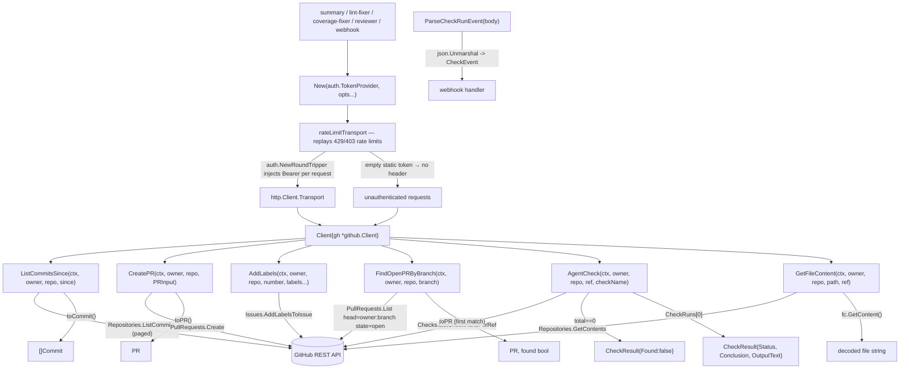

# GitHub REST API Client

A thin wrapper over a GitHub REST client library (`go-github/v78`)
exposing only what this service needs:

## Flow

Callers are the [summary](/modules/agents/summary.md),
[lint-fixer](/modules/agents/lintfixer.md), and
[coverage-fixer](/modules/agents/covfixer.md) workflows plus the
[webhook](/modules/platform/webhook.md) ingress; authentication comes from the
[auth](/modules/platform/auth.md) `TokenProvider` seam.

- `ListCommitsSince` — last-24h commit digests (summary workflow).
- `CreatePR` / `AddLabels` — open and label the agent's fix PR.
- `FindOpenPRByBranch` — the open PR for a head branch (used by `apply_fix` to reuse an
  existing agent PR instead of opening a duplicate). Lookup is by branch, not label.
- `AgentCheck` — the agent verify check's status/conclusion for a ref (resume).
- `GetFileContent` — a decoded file at a ref.
- `ParseCheckRunEvent` — decodes a GitHub `check_run` webhook body into a `CheckEvent`
  for the webhook handler.
- `CreateReview` — an advisory (`COMMENT`) review with inline comments. Inline comments
  require `CommitID`: GitHub resolves a comment's line against a commit, so an unpinned
  review resolves against whatever HEAD is current when the call lands. A push arriving
  mid-review would then anchor comments to the wrong lines or `422` the whole call, taking
  the summary comment and the check down with it. The client rejects inline comments with
  no `CommitID` rather than let that reach GitHub.

## Rate limiting

Every request — REST and the GraphQL minimize mutation alike — goes through a retrying
transport that sits **outside** auth, so a replay re-mints its token (an App installation
token can expire across a wait).

It retries only rate-limit rejections, never `5xx`. That is what makes replaying a `POST`
safe: a rate-limited request was refused before GitHub acted on it, so a replay cannot
double-post a review. A `502` carries no such guarantee, so it goes straight to the caller.
A `403` with no rate-limit headers is an ordinary permission error and is not retried.

The wait comes from `Retry-After` (secondary limits) or from `X-RateLimit-Reset` when
`X-RateLimit-Remaining` is `0` (the primary hourly quota), plus a second of slack for clock
skew. Waits are deliberately short-budgeted (≤ 60s, ≤ 3 replays): this runs inside a Cloud
Tasks dispatch that already retries with its own backoff, so a long primary-quota reset is
handed back rather than held open on a scale-to-zero instance. Every give-up logs.

Owner/repo are per-call so one client serves many repos. Deterministic tooling — no
agent imports. Tested by pointing a real client at a local HTTP-stub server (the
library's base-URL override pattern). Consumers define their own narrow interfaces
over this client for faking.
