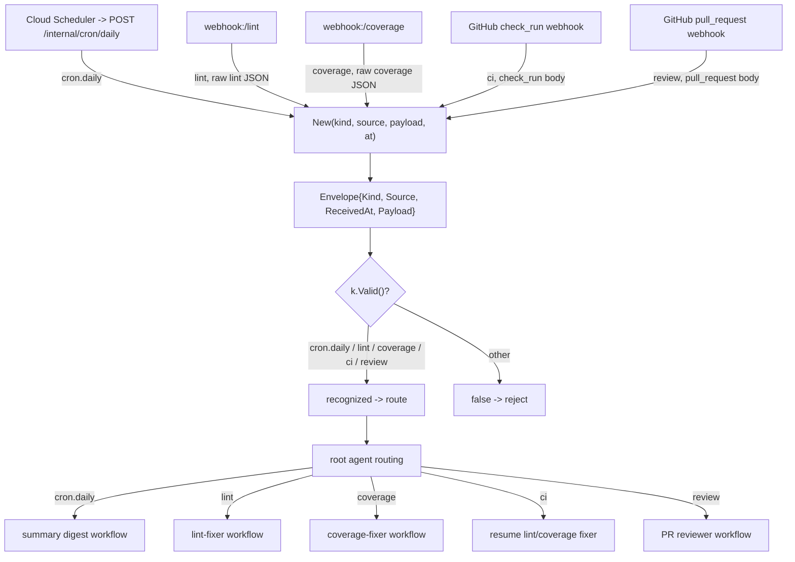

# Ingress Envelope

The normalized `Envelope` that every ingress source is reduced to before reaching
the [root agent](/modules/agents/root-dispatcher.md). `Kind` identifies the trigger
(cron.daily, lint, coverage, ci, review); `Payload` carries the raw source body for the
chosen workflow to parse.

## Flow

Envelopes originate in the [webhook](/modules/platform/webhook.md) ingress and route
to the [summary](/modules/agents/summary.md),
[lint-fixer](/modules/agents/lintfixer.md), and
[coverage-fixer](/modules/agents/covfixer.md) workflows.

Adding a new ingress (e.g. Jira) means adding a `Kind` here (including its `Valid()` entry and the cross-port wire contract), a handler that emits
an `Envelope` — the root agent's routing is the only other place that changes.

## Wire codec

`Encode`/`Decode` are the envelope's JSON wire form, used when it crosses the Cloud Tasks
boundary ([tasks](/modules/platform/tasks.md) → `POST /internal/dispatch`). The form —
`kind`/`source` strings, `received_at` RFC 3339, `payload` standard base64 — is an
external contract and must stay byte-identical across all four language ports. `Decode`
rejects an unknown `Kind` as a permanent (poison) error so the worker acks rather than
retries it. The in-process transport passes the struct directly and never touches the
codec.
