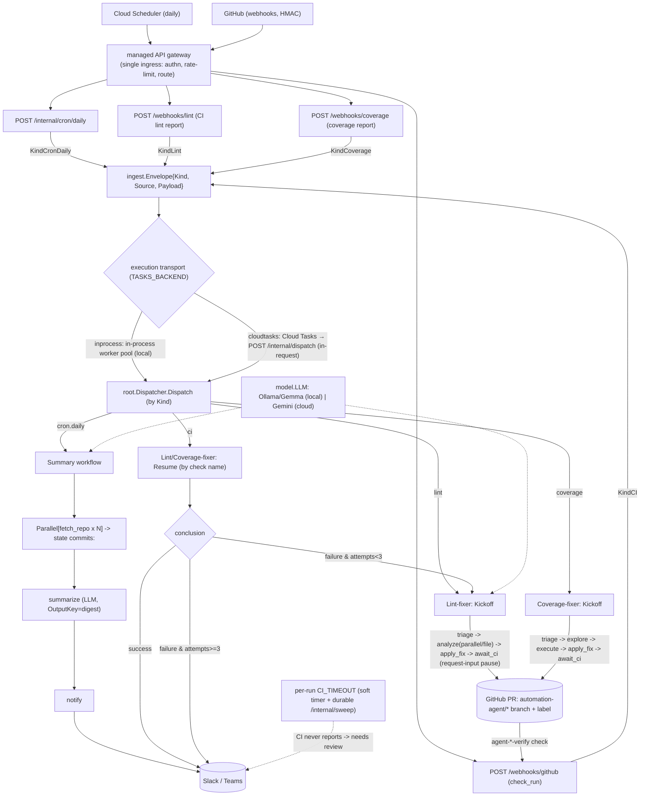
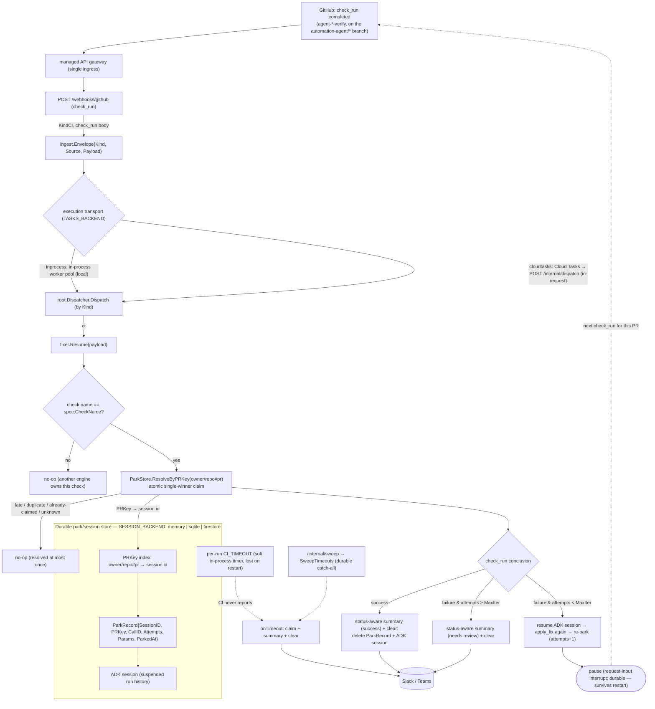

# The service — layout, flows, and conventions

`automation-agent` is a single Go service under `go/`, built on the Agent Development Kit for Go, `google.golang.org/adk/v2` v2.0.0. The design it implements is [/standards/architecture-design.md](/standards/architecture-design.md).

## System flow

## Resume flow (detailed)

The system flow above is kickoff-centric: an event arrives and a workflow starts. A fixer's **resume** is a separate, later request — the CI check for a parked run reports back minutes-to-hours after kickoff and re-enters through the same front door. Only the two fixers (lint, coverage) resume; the summary workflow is one-shot. The durable `ParkStore` lookup reconnects the event to its suspended run.

Attempts are counted in the `ParkRecord`, **not** from GitHub commits. Because the claim (`ResolveByPRKey` / `Sweep`) is atomic and single-winner, a late or duplicate webhook racing the timeout timer or the sweep resolves the run at most once.

## Mental model

Ingest (cron / webhook) → the [root dispatcher](/modules/agents/root-dispatcher.md) → one of the workflow agents: **summary** (commit digests), **lintfixer** (autonomous lint remediation with a PR + CI loop), or **covfixer** (test-coverage remediation, sharing the `fixflow` engine). The PR + CI suspend/resume loop runs on a workflow graph whose `await_ci` node pauses on a **request-input interrupt**, plus a `setup.ParkStore` of parked runs. Both the ADK `session.Service` and the `ParkStore` are selected by `SESSION_BACKEND` (`memory` | `sqlite` | `firestore`, default `memory`) and built once at startup in `go/internal/agent/setup`: with a durable backend a restart no longer strands in-flight runs; `memory` keeps ephemeral behavior.

Webhook-triggered work is handed to the **execution transport** (`go/internal/tasks`, switched by `TASKS_BACKEND`): `inprocess` runs it in an in-process worker pool (local/default), while `cloudtasks` (prod) enqueues to Cloud Tasks → `POST /internal/dispatch` so multi-minute compute runs **in-request** on Cloud Run (CPU stays allocated; scale-to-zero preserved). Deterministic, agent-free tooling lives under `go/internal/` and is called by agents but never imports them.

## Layout

- `go/cmd/agent/` — the service entrypoint (`package main`). Composition only: loads `.env` (optional) + `config`, builds the LLM and code LLM (`setup.BuildLLM` / `setup.BuildCodeLLM`), the `githubapi` client, the `SESSION_BACKEND`-selected session service + `ParkStore`, the notifier, the summary agent, and the lint/coverage `fixflow` engines sharing one `fixflow.Deps` (incl. `CITimeout`, `SessionService`, `ParkStore`); then the root dispatcher, the execution transport, and the webhook HTTP server (`ReadHeaderTimeout` 10s); blocks on SIGINT/SIGTERM, then shuts down the server and drains the transport.
- `go/cmd/playground/` — a local dev entrypoint (never deployed).
- `go/internal/` — all business logic: `config` (sole env reader), `ingest`, `notify`, `githubapi`, `gitrepo`, `webhook`, `tasks`, `obs` (OpenTelemetry, see [/standards/observability.md](/standards/observability.md)), `auth`, and `agent/{setup,root,summary,lintfixer,covfixer,fixflow,reviewer}`.
- `go/ARCH/` — architecture-conformance tests, pure standard library.

## Build / run / test

Run from the `go/` directory; `make help` lists all targets.

- `make build` — compile all packages; `make run` — run the service; `make playground` — local web UI at :8080.
- `make test` — all tests; `make cover` — coverage gate (≥80% over `internal/`; `cmd` is composition-only); `make cover-firestore` — Firestore-backed tests against a running emulator.
- `make lint` (golangci-lint), `make vet`, `make fmt`, `make tidy`, `make ollama-check`, `make docker`.
- `make arch` — architecture conformance (`go test ./ARCH/...`).
- `make ci` — the full local gate: `tidy vet lint arch test cover`.

## Conventions

Enforced by `go/ARCH/` + `make ci`:

- **Knowledge lives in the bundle** — the service is documented by the concepts in `/modules/` and the standards; the repo-root `AGENTS.md` is the guardrail sheet + pointer.
- **Build-agent pattern:** `agents_setup.go` is pure wiring (`Build<Name>Agent`); `<name>.go` holds the testable logic. See [/standards/agent-build-pattern.md](/standards/agent-build-pattern.md).
- **Import boundaries** (arch tests): tooling must not import `internal/agent/...`; provider SDKs (Ollama/Gemini/genai) only in `internal/agent/setup`; nothing imports `cmd/...`.
- **Prompts are markdown** under each agent's `prompts/` dir, loaded via `embed.FS`.
- **Testing:** ≥80% coverage; never assert on LLM output content. The cloud backends need the Firestore emulator (`make cover-firestore`).
- **Models:** default to local Ollama Gemma; never hardcode a provider in agents.
