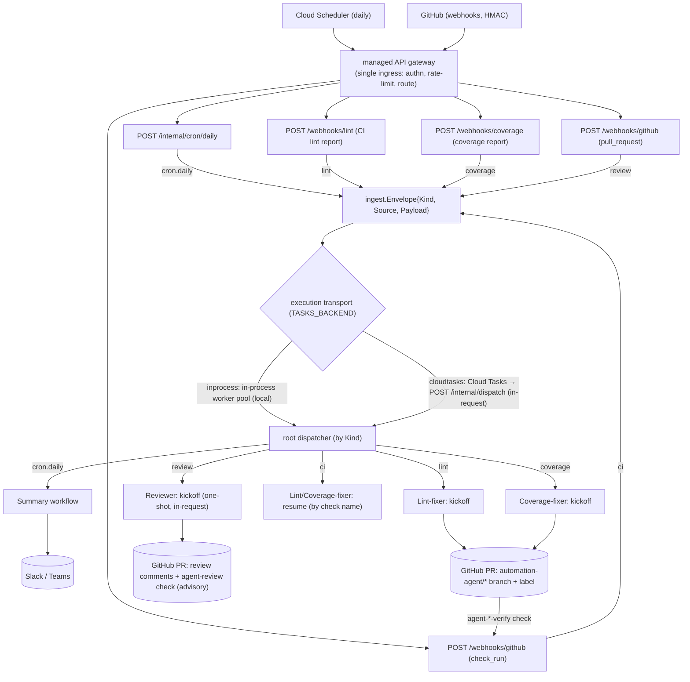
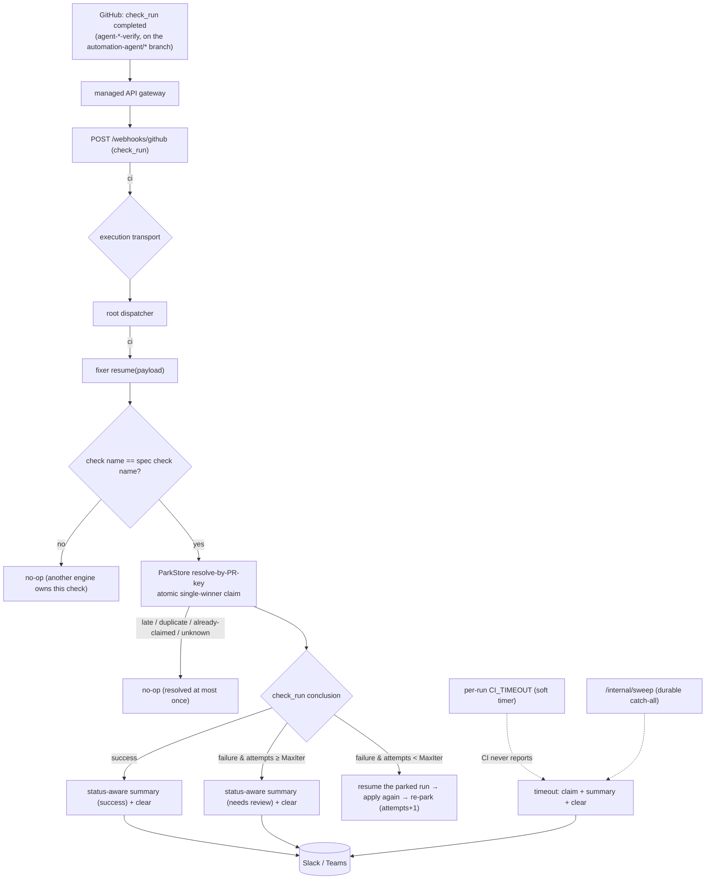

Every piece of work enters through a single front door and is normalized before any agent
sees it. There are two distinct journeys: **kickoff** (an event starts a workflow) and
**resume** (a CI verdict re-enters a parked fix run).

## Kickoff flow

Key properties:

- **Normalization first.** Every source becomes one `Envelope{Kind, Source, Payload}`
  before routing — see [ingest](/modules/platform/ingest.md). New sources add a `Kind`,
  not a new path.
- **The execution transport** ([tasks](/modules/platform/tasks.md)) decides *where* the
  multi-minute LLM compute runs: an in-process worker pool locally, or Cloud Tasks
  re-entering `POST /internal/dispatch` in production so compute runs in-request on
  allocated CPU (Cloud Run scale-to-zero preserved).
- **One dispatcher.** The [root dispatcher](/modules/agents/root-dispatcher.md) is the
  only place that maps `Kind` → workflow. The webhook layer
  ([webhook](/modules/platform/webhook.md)) verifies signatures and parses; it never
  routes.

## Resume flow (parked fix runs)

A fixer's resume is a separate, later request: the CI check for a parked run reports back
minutes-to-hours after kickoff and re-enters through the same front door as Kind `ci`.
Only the two fixers resume; summary and the reviewer are one-shot.

Attempts are counted in the park record, **not** from GitHub commits. The atomic claim
(resolve-by-PR-key / sweep) guarantees a late or duplicate webhook racing the timer or
the sweep resolves a run at most once. The full mechanism — including why durability
lives at the session layer — is in
[suspend/resume design](/orientation/suspend-resume-design.md).
