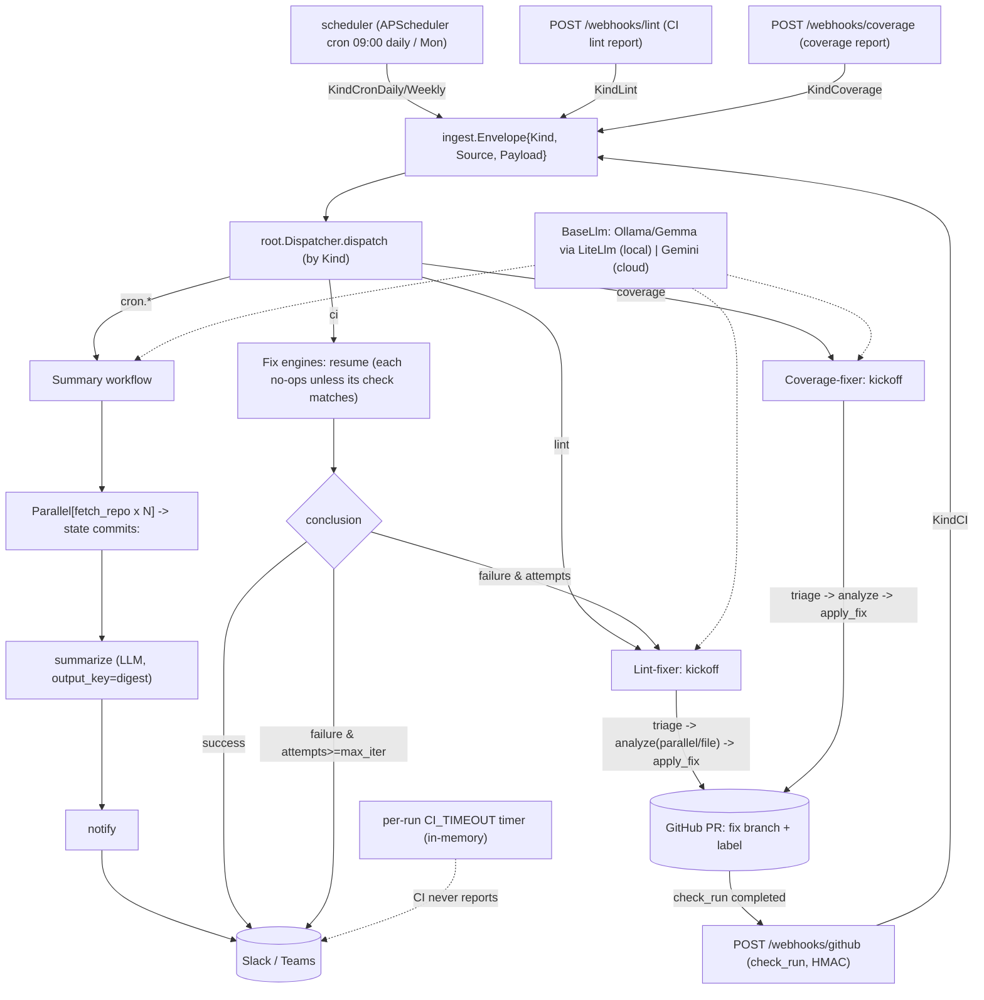

# automation-agent (Python / ADK)

This package is an automation service built on the Agent Development Kit (ADK).
Read [`.agents/standards/architecture-design.md`](../.agents/standards/architecture-design.md) first — it is the
authoritative design.

## System flow

## Mental model

Ingest (cron / webhook / future hooks) -> **root agent** (dispatcher) -> one of three
workflow agents: **summary** (commit digests), **lintfixer** (autonomous lint
remediation with a PR + CI loop), or **covfixer** (coverage remediation; shares the
fixflow engine with the lint-fixer). Deterministic, agent-free tooling lives under
`automation_agent/` and is called by agents but never imports them.

## Conventions (enforced by `arch/` + `make ci`)

- **Every directory has an `AGENTS.md`.** Agent directories use one shared doc
  covering both `agents_setup.py` and the testable logic files.
- **Build-agent pattern:** `agents_setup.py` is pure wiring (`build_<name>_agent`);
  the logic files hold the testable behavior. See `../.agents/standards/agent-build-pattern.md`.
- **Import boundaries:** tooling must not import `automation_agent.agent...`; provider
  SDKs (LiteLlm/Gemini/genai) only in `automation_agent/agent/setup`; nothing imports `cmd`.
- **Prompts are markdown** under each agent's `prompts/` dir, loaded via `importlib.resources`.
- **Testing:** >=80% coverage (`make cover`). Never assert on LLM output content.
- **Models:** default to local Ollama Gemma (`LiteLlm`); do not hardcode a provider in agents.

## Working here

- `make help` lists targets. `make ci` is the full local gate.
- Lint/type-check via `ruff` + `mypy`; coverage measured over `automation_agent/`.
- New features/changes get a spec in `specs/` (gitignored).
