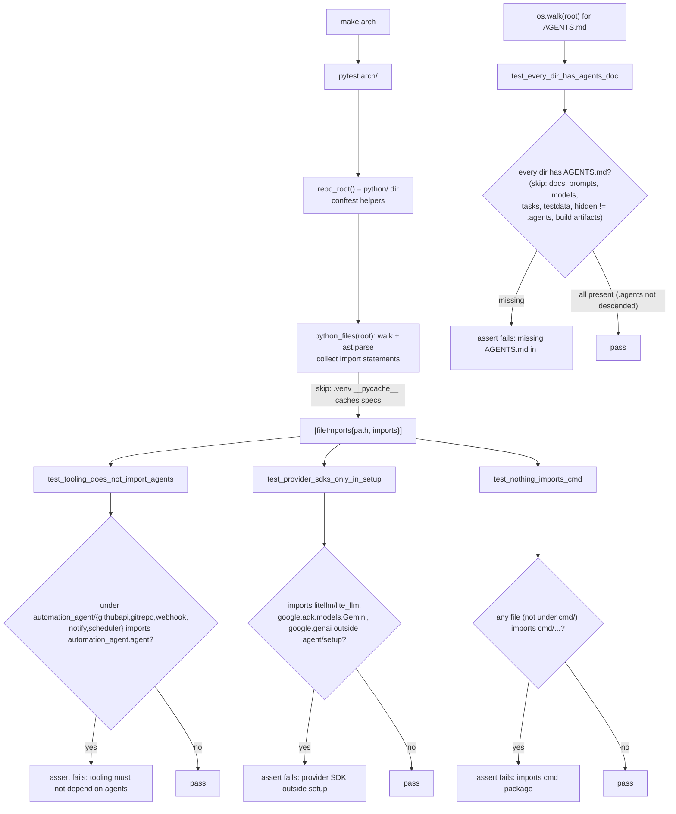

# arch

Architecture-conformance tests. Pure standard-library (the `ast` module, no external
deps beyond pytest) so they run anywhere. Run with `make arch`.

## Flow

Current rules:

- `test_tooling_does_not_import_agents` (`arch/test_arch.py`) —
  `automation_agent/{githubapi,gitrepo,webhook,notify,scheduler}` must not
  import `automation_agent.agent...`.
- `test_provider_sdks_only_in_setup` (`arch/test_arch.py`) — `litellm`/`lite_llm`/
  `google.adk.models.Gemini`/`google.genai` imports are confined to
  `automation_agent/agent/setup`.
- `test_nothing_imports_cmd` (`arch/test_arch.py`) — no package imports `cmd/...`.
- `test_every_dir_has_agents_doc` (`arch/test_docs.py`) — every non-exempt directory
  has an `AGENTS.md`.

Add a new test here whenever we introduce a structural rule worth protecting.
