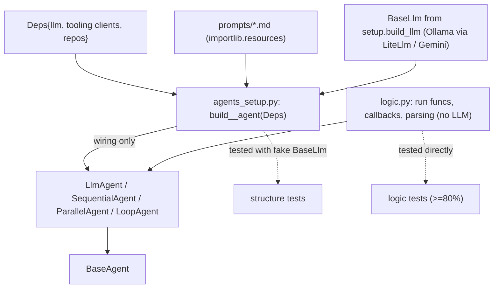

# automation_agent/agent

The agents. Each workflow agent gets its own directory (`root/`, `summary/`,
`lintfixer/`, …), and shared utilities live in `setup/`.

## Flow

## The build-agent pattern (shared convention for every agent dir)

Each agent directory uses **one** `AGENTS.md` and splits wiring from logic:

- `agents_setup.py` — pure wiring: `build_<name>_agent(d: Deps) -> BaseAgent`,
  assembling ADK constructs from injected dependencies. No logic, no I/O.
- the logic file(s) — the testable behavior: code-agent run funcs, tool impls,
  callbacks, parsing.

See `../../../.agents/standards/language-parity.md`. Agents depend on the deterministic tooling in
`automation_agent/...` and on `setup`; they never import `cmd`.

## Models

Agents receive a `BaseLlm` from `setup.build_llm` — they must not import a
provider SDK directly. Default local backend is Ollama + Gemma (via `LiteLlm`); Gemini is the
cloud path. The switch is config-driven.

## Prompts

Each agent ships its own `prompts/*.md` and reads them via `setup.Prompts`
(`importlib.resources`). Prompts are markdown, kept next to the agent.
