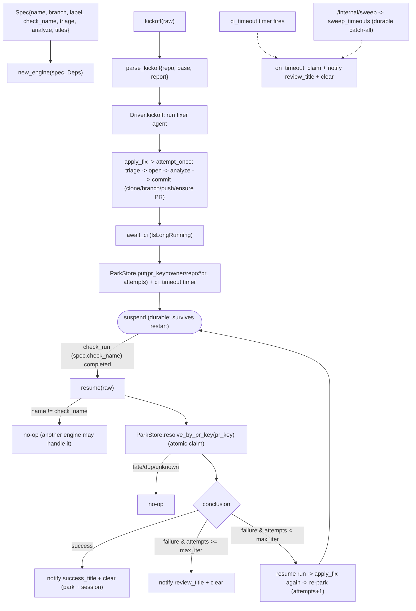

# automation_agent/agent/fixflow

The reusable engine behind the PR-fixing agents (lint-fixer, coverage-fixer, …). It
owns the event-driven fix loop — kickoff -> apply -> **suspend across the CI wait** -> CI
resume -> loop or finish — plus the apply mechanics. Each concrete agent supplies a
`Spec` (its own triage fn, analyze fn, and branch/label/check names) **and its own
prompts**; nothing about the LLM prompting is shared here.

The CI wait is a real ADK **IsLongRunning** suspend/resume: the `Driver` runs a `fixer`
agent that calls `apply_fix` then parks on `await_ci`. Both the ADK session and the parked
run are persisted through `SESSION_BACKEND` (`memory` | `sqlite` | `firestore`): the run is
recorded in the injected `setup.ParkStore` (a `ParkRecord` keyed by a UUID session id, with
an `owner/repo#pr` `pr_key` index for CI resume). With a durable backend a process restart
resumes in-flight runs; the default `memory` backend stays ephemeral (a restart strands
them). Attempts are counted in the park record — **not** from GitHub commits. A run whose
CI never reports is freed two ways: a soft per-run asyncio `ci_timeout` timer (in-process,
lost on restart) and the durable `sweep_timeouts` catch-all (driven by `/internal/sweep`).
`resolve_by_pr_key`/`sweep` claim a run atomically (single winner), so a late/duplicate
webhook racing the timer/sweep resolves it at most once.

Terminal resolution (`_clear`) deletes both the park record and the ADK session
(`LongRunDriver.delete_session`) so durable backends don't accumulate finished runs.

The outer loop is driven by a deterministic `setup.Sequencer` (a class extending
`BaseLlm` that emits a fixed apply->await sequence), so retry/stop/timeout policy is all
in the `Driver`, not the model. The substantive LLM work (triage, exploration, code edits) happens inside
`apply_fix` -> `attempt_once`.

## Flow

## Files

- `engine.py` — `Engine` + `Spec` + `Deps` + `FileWork`/`FileEdit`/`AnalyzeInput`;
  `kickoff`/`resume` (delegate to the Driver) + `attempt_once` (one apply attempt).
- `driver.py` — `Driver`: the `apply_fix`/`await_ci` tools, the `fixer` agent (on a
  deterministic sequencer model), the `RunParams` (serialized into the park record), and the
  kickoff/resume/on_timeout/`sweep_timeouts` lifecycle over the injected `setup.ParkStore`
  (the in-memory `RunRegistry` it replaced is gone). Terminal `_clear` deletes the park
  record **and** the ADK session. The triage `work` cache is an in-process optimization
  (not serialized), so a warm process skips re-triage while a restart simply re-triages.
- `applyfix.py` — clone -> branch (new/existing) -> commit -> push -> ensure labeled PR.
- `analyze.py` — `parallel_analyze`: one ADK parallel agent per `FileWork`, distinct
  state keys so they never collide.
- `envelope.py` — the trusted `{repo, base, report}` kickoff envelope.
- `util.py` — `Engine.label()`, `extract_json_array/object`, `strip_fences`.

The generic suspend/resume plumbing (`LongRunDriver`, the `Sequencer` class) lives in
`automation_agent/agent/setup` (it touches `genai`, which arch confines to `setup`).

Multiple engines can each be handed a `check_run` event; only the one whose
`check_name` matches acts. Tested with fake triage/analyze + a local seed repo + fakes,
driving the real ADK runner through park/resume.
