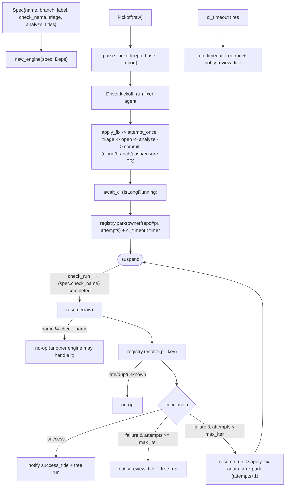

# automation_agent/agent/fixflow

The reusable engine behind the PR-fixing agents (lint-fixer, coverage-fixer, …). It
owns the event-driven fix loop — kickoff -> apply -> **suspend across the CI wait** -> CI
resume -> loop or finish — plus the apply mechanics. Each concrete agent supplies a
`Spec` (its own triage fn, analyze fn, and branch/label/check names) **and its own
prompts**; nothing about the LLM prompting is shared here.

The CI wait is a real ADK **IsLongRunning** suspend/resume on an **in-memory** session:
the `Driver` runs a `fixer` agent that calls `apply_fix` then parks on `await_ci`. The
parked run is tracked in an in-memory **registry** (keyed by `owner/repo#pr`); there is
no durable store and no reconciler, so a process restart strands in-flight runs (an
accepted trade). Attempts are counted in the registry — **not** from GitHub commits.
A per-run `ci_timeout` timer frees a run whose CI never reports.

The outer loop is driven by a deterministic `setup.Sequencer` (a class extending
`BaseLlm` that emits a fixed apply->await sequence), so retry/stop/timeout policy is all
in the `Driver`, not the model. The substantive LLM work (triage, exploration, code edits) happens inside
`apply_fix` -> `attempt_once`.

## Flow

## Files

- `engine.py` — `Engine` + `Spec` + `Deps` + `FileWork`/`FileEdit`/`AnalyzeInput`;
  `kickoff`/`resume` (delegate to the Driver) + `attempt_once` (one apply attempt).
- `driver.py` — `Driver`: the `apply_fix`/`await_ci` tools, the `fixer` agent (on a
  deterministic sequencer model), and the kickoff/resume/on_timeout lifecycle over the
  registry.
- `registry.py` — in-memory parked-run registry; atomic `resolve` (one of webhook/timer
  wins).
- `applyfix.py` — clone -> branch (new/existing) -> commit -> push -> ensure labeled PR.
- `analyze.py` — `parallel_analyze`: one ADK parallel agent per `FileWork`, distinct
  state keys so they never collide.
- `envelope.py` — the trusted `{repo, base, report}` kickoff envelope.
- `util.py` — `Engine.label()`, `extract_json_array/object`, `strip_fences`.

The generic suspend/resume plumbing (`LongRunDriver`, the `Sequencer` class) lives in
`automation_agent/agent/setup` (it touches `genai`, which arch confines to `setup`).

Multiple engines can each be handed a `check_run` event; only the one whose
`check_name` matches acts. Tested with fake triage/analyze + a local seed repo + fakes,
driving the real ADK runner through park/resume.
