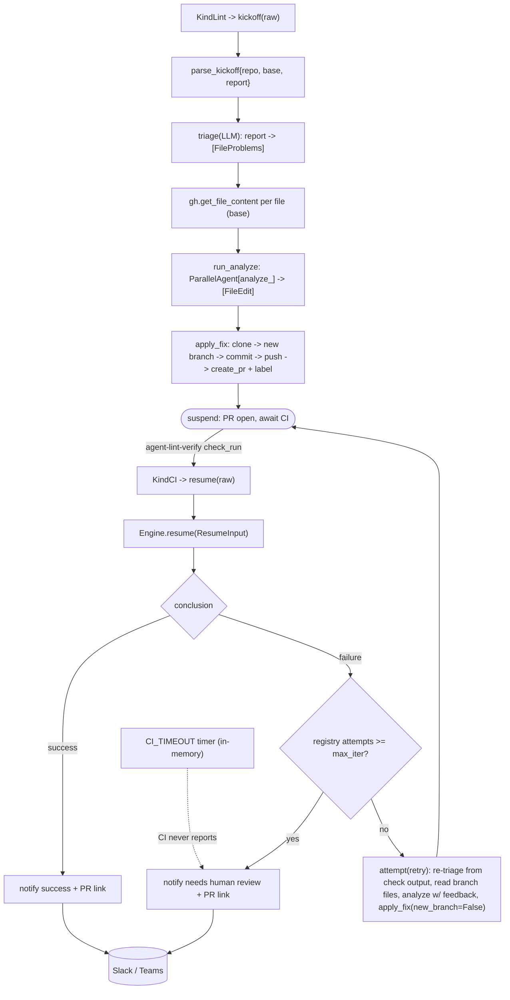

# automation_agent/agent/lintfixer

The autonomous lint-remediation workflow. It is a configuration of the shared
`fixflow` engine: its own triage/analyze functions and prompts, on `fixflow`'s
deterministic kickoff -> suspend -> CI resume -> loop or finish loop. The wait is a real
ADK long-running suspend/resume because CI takes 20–40 min. The parked run is tracked in
`fixflow`'s **in-memory** registry (keyed by `owner/repo#pr`); there is no durable
store, so a process restart strands in-flight runs, and a per-run `CI_TIMEOUT` timer
bounds each wait.

## Flow

- **Kickoff** (`KindLint`) -> `Fixer.kickoff`: parse the trusted `{repo, base, report}`
  envelope -> `triage` (LLM normalizes the arbitrary report) -> fetch file contents ->
  `run_analyze` (one parallel agent per file) -> `apply_fix` (branch, commit, push,
  labeled PR) -> suspend.
- **Resume** (`KindCI`) -> `Engine.resume` (the `fixflow` Driver): on the agent verify
  check completing — success -> notify; failure & attempts < max -> re-analyze with CI
  feedback and push onto the same branch; failure & attempts >= max -> notify "needs
  human review" + PR link. Attempts are counted in `fixflow`'s in-memory registry, not
  from GitHub commits. There is no reconcile loop: a parked run whose CI never reports
  is freed by its per-run `CI_TIMEOUT` timer (-> "needs human review").

## Files

- `lint.py` — `new_engine(Deps)`: the lint `Spec` (branch/label/check + titles) that
  configures the shared `fixflow` engine.
- `triage.py` — LLM report normalization (format-agnostic; live-proven).
- `analyze.py` — parallel per-file fix agents (live-proven).
- `loader.py` — prompt loading over this dir's `prompts/`.
- `prompts/{triage,analyze,summarize_result}.md`.

Wiring: `root` registers `KindLint`/`KindCI`; `cmd` builds the engine (via
`new_engine`), the scheduler, and the webhook server. The kickoff/suspend/resume
mechanics live in `fixflow`. Provider SDKs (genai) are kept out via `setup` helpers.
Tests use a stub/scripted LLM + fakes + a local seed repo; live LLM tests are gated
behind `OLLAMA_LIVE`. See `docs/architecture.md` §8.
