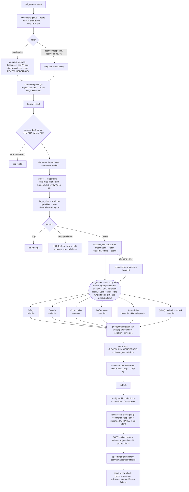

# agent/reviewer

The in-house **PR code-review** workflow. It reacts to GitHub `pull_request` events and posts a
CodeRabbit-style review — per-category sub-agent findings, a count-based scorecard, inline
comments with ```suggestion blocks, an "🤖 Prompt for AI agents" block, and an **advisory**
`agent-review` check (never a merge gate). It is **comment-only** and never opens PRs.

Unlike the lint/coverage fixers, the reviewer is **not** a suspend/resume fix loop: it is mostly
one-shot per `pull_request` event and does not park on `await_ci`. Its long LLM compute runs
**in-request** via the execution transport (`Kind.REVIEW` → `/internal/dispatch`), so CPU stays
allocated on Cloud Run.

## Flow



## Trigger — native-event kickoff

The reviewer's kickoff is a **native GitHub event** (`pull_request`), not a custom POST route. The
GitHub App delivers it to the single `/webhooks/github` URL, where the handler routes by the
`X-GitHub-Event` header (`pull_request` → `Kind.REVIEW`, `check_run` → `Kind.CI`, anything else →
200 no-dispatch).

## Coalesce-to-latest — debounce + staleness

Rapid pushes to one PR are collapsed so only the latest SHA is reviewed (two parts, because Cloud
Tasks gives no ordering and cannot cancel an in-flight task):

- **Debounce at enqueue** (`enqueue.py`, `enqueue_options`): a `synchronize` review is enqueued
  with `REVIEW_DEBOUNCE` delay under a per-PR-per-window Cloud Tasks dedup name, so a burst of
  pushes collapses to one delayed task. The name carries a time bucket (receipt time floored to
  the debounce window) so a push minutes later doesn't collide with Cloud Tasks' ~1h name
  reservation. `opened`/`reopened`/`ready_for_review` enqueue immediately. Only the Cloud Tasks
  backend honors the hints.
- **Staleness at execution** (`Engine.kickoff` → `_superseded`): before doing the review work, the
  engine fetches the PR's current head SHA and skips if it no longer matches the event's SHA.
  Best-effort — a lookup error proceeds rather than suppressing a real review.

**Incremental re-review** is intentionally **not** built: GitHub-as-store persists rendered
comments, not structured findings, so the latest SHA is always reviewed in full and reconciled
against the existing comments.

## Data layer — REST-first (GraphQL only for minimize)

The reviewer reads the PR and posts its output via the GitHub REST API (`githubapi.Client`),
over the shared auth provider (App installation token in production, PAT locally):

- **Read:** changed files + patches (`list_pr_files`), file content at the head SHA
  (`get_file_content`), the repo tree (`tree`), the head SHA (`pull_request_head_sha`), and the
  existing review comments (`list_review_comments`).
- **Write:** the review (`create_review` — inline comments + ```suggestion), the marker summary
  comment (`upsert_marker_comment`), and the `agent-review` check run (`create_check_run`).
- **The `agent-review` check is REST-only** — GraphQL has no check-run mutation. The **only**
  GraphQL is `minimize_comment` (collapse an outdated comment as `OUTDATED`).

### Reconciliation — GitHub-as-store (no local durable state)

Every inline comment carries a hidden fingerprint marker `<!-- ar-fp:<file:line:normalizedMessage>
-->`, so GitHub itself holds the per-PR review state. On each publish (`reconcile.py` +
`publish.py`): **keep** a finding already represented by a comment (idempotent), **add** a finding
with no existing comment, and **minimize** an existing fingerprinted comment whose finding is gone.
Minimization is best-effort — a single failure logs and continues so the summary and check still
publish. The `already_published` head-SHA guard protects the non-comment outputs (summary, check,
deny) from duplicating on a redelivered task.

## Intake pipeline

`Engine.decide` runs a deterministic, model-free intake and produces a `Decision` (skip / deny /
review):

1. **Parse** the event (`githubapi.parse_pull_request_event`).
2. **Trigger gate** — only `opened` / `reopened` / `synchronize` / `ready_for_review` proceed.
3. **Skip rules** — draft (unless `ready_for_review`), the agent's own `automation-agent/*`
   branches, the `skip-review` label, and dependency-bot authors.
4. **Fetch** the changed files + patches (`list_pr_files`).
5. **Filter** generated/vendored/lockfile/minified/binary paths (`filter.py`); size is computed on
   the **filtered** set. An empty filtered diff skips.
6. **Size gate** — two-dimensional (`REVIEW_MAX_FILES` **and** `REVIEW_MAX_DIFF_BYTES`): over
   either cap denies (review-or-deny, no degrade tier).

## Review stage (category fan-out → glue → scorecard)

`review.py`: **fan out** one agent per applicable category over the whole filtered diff, in
parallel (ADK `ParallelAgent`). The consolidated set: Safety + Security + Code quality (code tier),
Performance + Accessibility (base tier; accessibility only when UI/markup changed) + an `(other)`
catch-all demoted to nitpick. The **glue/synthesis** pass (code tier, always) adds architectural
alignment, testability, test coverage. Then the deterministic gates in code (`glue.py`,
`standards.py`): drop below `REVIEW_MIN_CONFIDENCE`, apply the standards citation gate, collapse
cross-lens duplicates by fingerprint. The **scorecard** (`scorecard.py`) is a per-dimension
severity histogram → level (🔴 any critical or ≥2 major · 🟡 any major or ≥3 medium · 🟢 else);
overall = critical-cap (any critical in security / runtime safety → 🔴) combined with the worst
dimension.

## Standards-aware review

`standards.py` steers off the conventions of the repo **under review** — `.agents/standards`,
`.cursor/rules`, `CLAUDE.md`, whatever that repo has. All API-only (no clone): **discover** the
tree and match `REVIEW_STANDARDS_GLOBS` (per-module scoping — a per-directory instruction file
applies only to touched modules), **distill** the docs with the base-tier model into one uniform
tagged rule list, **cache** per repo + docs SHA, **inject** the compact rule menu into every lens
(with a lazy `get_rule` tool for full text), and **gate citations** (`REVIEW_UNCITED_MODE`): a
conformance finding that cites no real injected `rule_id` is dropped or demoted to nitpick. A
truncated tree, no docs, or a distill/fetch error degrades to a **generic** review (uncached).

## Publish stage (CodeRabbit-style, advisory, all REST)

`publish.py` posts the scored review; nothing here gates a merge. Actionable (critical/major/medium)
findings on a commentable head-side line (`hunks.py`) post **inline**; actionable findings outside
the diff go to the summary's **🔭 Outside diff range** section (never snapped to a wrong line);
nitpicks collapse into **🧹 Nitpicks**. The summary is marker-updated
(`<!-- automation-agent:review:<owner>/<repo>#<n> -->`) so a re-review edits it in place. The
`agent-review` check: green → `success`, yellow/red → `neutral` — **never** `failure`. Deny posts
the "too large, please split" summary + a neutral check.

## Structured output

Category agents request `application/json` (valid JSON syntax) and describe the exact findings
schema in their prompt; `parse_findings` recovers **defensively** — it extracts the first decodable
JSON array from the model text, tolerates fences/prose, and treats a malformed body as no findings
(empty = success). Best-effort by design; the narrow single-lens prompts are themselves the
false-positive control.

## Files

- `reviewer.py` — `Deps`, `Engine`, `new_engine`, `Engine.kickoff`, and the `decide` intake +
  skip helpers. Gated by `REVIEW_ENABLED` (default false, the kill switch).
- `filter.py` — the exclude-glob `FileFilter` and the filtered patch-byte total.
- `sizegate.py` — `oversize`, the two-dimensional file-count/diff-byte cap.
- `findings.py` — the `Finding` schema, severity/dimension normalization, `fingerprint`, and the
  defensive `parse_findings`.
- `categories.py` — the consolidated category set + `select_categories` (UI-only gating).
- `scorecard.py` — the count-based `score_findings`.
- `glue.py` — the deterministic verify gate + cross-lens `dedupe`.
- `review.py` — `run_review`: the fan-out drive, glue drive, diff formatting, and instruction
  composition.
- `hunks.py` — `commentable_lines` / `DiffIndex.in_diff`: which head-side lines take an inline
  comment.
- `publish.py` — `publish` / `publish_deny`: the CodeRabbit-style assembly + REST writes.
- `reconcile.py` — the fingerprint marker and the pure `reconcile`.
- `standards.py` — discovery, the distiller orchestration + defensive `parse_rules`, the per-repo
  `StandardsCache`, the rule menu / lazy `get_rule` tool, and `gate_citations`.
- `enqueue.py` — `enqueue_options`: the debounce/coalesce transport hints.
- `agents_setup.py` — the build-agent split: pure ADK wiring (category + glue + distiller LLM
  agents, the prompt loader, the JSON `generate_content_config`).
- `prompts/*.md` — one markdown prompt per category, the glue pass, and the standards distiller.

Wiring: `root` registers `Kind.REVIEW` → `Engine.kickoff`; `cmd` builds the engine (via
`new_engine`) from config and injects the `githubapi` client. Provider SDKs stay out via `setup`
helpers. Tests are deterministic glue only — no assertions on LLM output.
