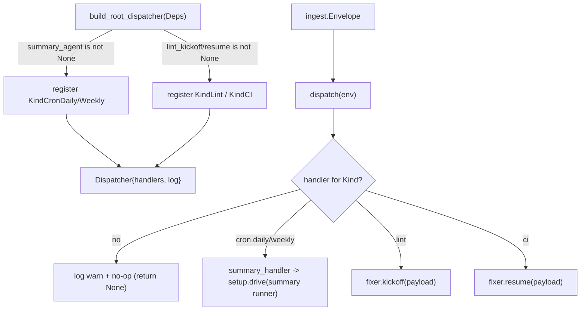

# automation_agent/agent/root

The dispatcher kicked off for every ingest. Build-agent pattern:

## Flow

- `root.py` — `Dispatcher`: routes an `ingest.Envelope` to a `Handler` by `Kind`.
  Unregistered kinds are logged and ignored (so a not-yet-wired ingress is a no-op).
- `agents_setup.py` — `build_root_dispatcher(Deps)` registers the available workflows:
  cron kinds -> the summary workflow runner. `KindLint`/`KindCI` are registered by the
  lint-fixer in a later phase.

Keeping a single entry point is the point of "root": new ingress sources
(GitHub/Jira/Confluence/human) and smarter routing (e.g. LLM-based) slot in here
without restructuring. Today it is a deterministic dispatcher; it can become an ADK
agent when LLM routing is wanted.

Tested directly (routing, unhandled no-op, error propagation) plus a build test that
drives a real runner with a trivial stub agent — no LLM needed.
