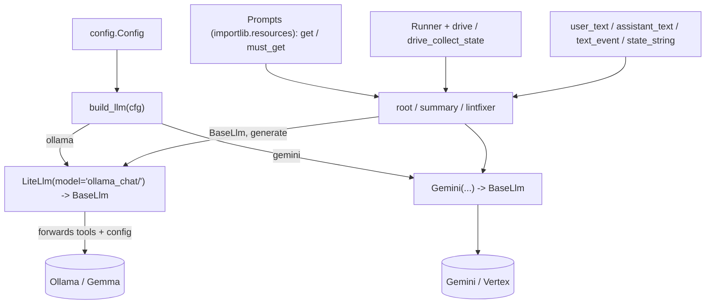

# automation_agent/agent/setup

Shared utilities for building agents. **This is the only package allowed to import
provider SDKs** (LiteLlm / Gemini / genai) — enforced by `arch/`.

## Flow

- `llm.py` — `build_llm(cfg)`: the provider switch returning a `BaseLlm`. Provider
  selection lives entirely here — Ollama is `LiteLlm(model="ollama_chat/<model>")`
  and the cloud path is Gemini. There are **no** separate `ollama.py`/`gemini.py`
  adapter files; ADK's `LiteLlm` is the Ollama path.
- `prompt.py` — `Prompts`, a markdown loader over package resources (each agent ships
  its own `prompts/` dir, read via `importlib.resources`).
- `events.py` — small genai content helpers (`user_text`, `content_text`, `last_text`).
- `runner.py` — in-memory runner helpers (`Runner`, `drive`, `drive_text`,
  `drive_collect_state`).
- `longrun.py` — generic ADK **IsLongRunning** suspend/resume plumbing: `LongRunDriver`
  (`start`/`resume` returning a plain `DriveResult`, plus `delete_session` for terminal
  cleanup, over an injectable `BaseSessionService`) and the `Sequencer` class, a
  deterministic Action->Wait `BaseLlm` for two-phase wait loops. Lives here because it
  touches `genai`; callers (e.g. `fixflow`) stay genai-free. Verified end-to-end in
  `tests/test_suspend_resume.py` + `tests/test_longrun.py`.
- `session.py` — `new_session_service(cfg)`: the `SESSION_BACKEND` switch returning an ADK
  `BaseSessionService` (the durable suspend/resume history of the parked fix loop). `memory`
  is in-process; `sqlite` uses adk's `SqliteSessionService`; `firestore` uses adk's **native**
  `FirestoreSessionService` (no hand-roll — only the park store is custom). Infra backends are
  confined here by `arch/`.
- `parkstore.py` — `ParkStore` (async ABC) + `ParkRecord` + `MemoryParkStore` +
  `SqliteParkStore` (aiosqlite, atomic CAS claim, WAL + busy_timeout, single shared
  connection) + `new_park_store(cfg)`: the durable park-record store (pr_key -> session,
  attempts, opaque run params) that replaced the in-memory `RunRegistry`.
  `resolve_by_pr_key`/`sweep` are atomic single-winner claims across all backends.
- `parkstore_firestore.py` — `FirestoreParkStore`: the cloud park store on the native
  `firestore.AsyncClient`, with the atomic claim in a Firestore transaction (the park record
  is our app concept, so it is hand-rolled unlike the session service). Exercised only against
  the Firestore emulator (`make cover-firestore`), so it is omitted from the default coverage
  gate.
- `generate.py` — text-generation helpers over the configured `BaseLlm`.

Tests stub the Ollama HTTP endpoint (`respx`) and use in-memory resources for prompts —
no real network, no live model. Never assert on LLM output content.
