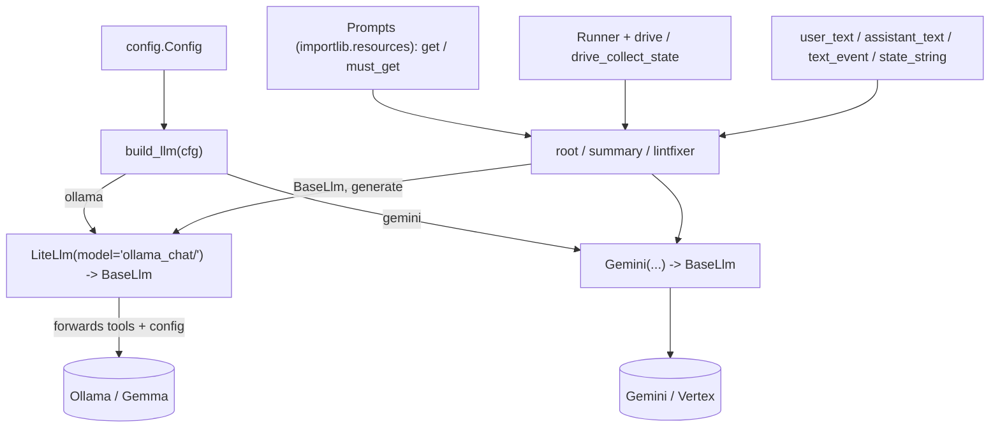

# automation_agent/agent/setup

Shared utilities for building agents. **This is the only package allowed to import
provider SDKs** (LiteLlm / Gemini / genai) — enforced by `arch/`.

## Flow

- `llm.py` — `build_llm(cfg)`: the provider switch returning a `BaseLlm`. Provider
  selection lives entirely here — Ollama is `LiteLlm(model="ollama_chat/<model>")`
  and the cloud path is Gemini. There are **no** separate `ollama.py`/`gemini.py`
  adapter files; ADK's `LiteLlm` is the Ollama path (the Go variant hand-rolls an
  Ollama adapter because adk-go has no built-in Ollama model).
- `prompt.py` — `Prompts`, a markdown loader over package resources (each agent ships
  its own `prompts/` dir, read via `importlib.resources`).
- `events.py` — small genai content helpers (`user_text`, `content_text`, `last_text`).
- `runner.py` — in-memory runner helpers (`Runner`, `drive`, `drive_text`,
  `drive_collect_state`).
- `longrun.py` — generic ADK **IsLongRunning** suspend/resume plumbing: `LongRunDriver`
  (`start`/`resume` returning a plain `DriveResult`) and the `Sequencer` class, a
  deterministic Action->Wait `BaseLlm` for two-phase wait loops. Lives here because it
  touches `genai`; callers (e.g. `fixflow`) stay genai-free. Verified end-to-end in
  `tests/test_suspend_resume.py` + `tests/test_longrun.py`.
- `generate.py` — text-generation helpers over the configured `BaseLlm`.

Tests stub the Ollama HTTP endpoint (`respx`) and use in-memory resources for prompts —
no real network, no live model. Never assert on LLM output content.
