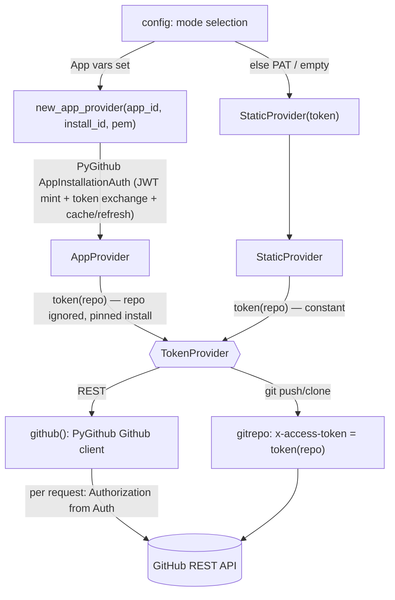

# automation_agent/auth

The GitHub authentication seam. One protocol, `TokenProvider`, hides whether a token
comes from a static PAT (local-dev fallback) or a freshly minted GitHub App
installation token (production). See
`specs/20260625-github-app-authentication.md`. Mirrors `go/internal/auth`.

## Flow

- `TokenProvider.token(repo)` — the seam. `repo` is `"owner/name"`. PAT mode returns
  the same constant for every repo; App mode mints/caches a short-lived (~1h)
  installation token and refreshes it before expiry. The seam is the **cross-port
  contract** (`language-parity.md`); the library is per-port detail.
- `TokenProvider.github()` — the same credential as a ready PyGithub `Github` REST
  client. The Go reference bridges the seam with a token-injecting `http.RoundTripper`;
  PyGithub already owns the REST client and its auth refresh, so the idiomatic Python
  shape is to hand back a ready client. External behavior is identical.
- `StaticProvider` — constant token. Backs the PAT fallback and the empty (anonymous,
  public-read/test) client. An empty token is valid.
- `AppProvider` — wraps PyGithub's native `AppInstallationAuth` pinned to **one**
  installation id (single-org per deployment — spec §1), so there is no per-owner cache
  and no dynamic `repo→installation` resolution. The `repo` argument is accepted for the
  contract but ignored. One `AppInstallationAuth` backs both `token()` and `github()`, so
  REST and git share one cached installation token (no double mint). `base_url` overrides
  the token-exchange endpoint for tests.

Mode selection and PEM/env handling live in `config` (not here): this package only
consumes an already-resolved app id / installation id / private-key PEM / PAT.
Deterministic tooling — no agent imports. Tested with a throwaway RSA key + a local
stub HTTP server for the token exchange (no live network, no LLM).
