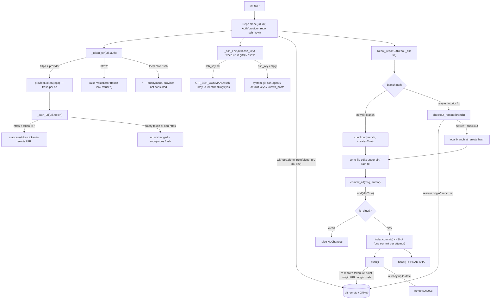

# automation_agent/gitrepo

Working-tree git operations via `GitPython`:

## Flow

- `clone(url, dir, Auth{provider, repo, ssh_key})` — auth is chosen by the URL scheme,
  not the caller. An `https` remote resolves a token from `provider.token(repo)` and uses
  it as GitHub `x-access-token` HTTP auth (anonymous when the provider is `None` or yields
  `""`). A plaintext `http://` remote is **refused** — sending a token as basic auth over
  an unencrypted transport would leak it. A `git@…`/`ssh://…` remote (built upstream when
  `GIT_TRANSPORT=ssh`) is left untouched, so the system `git` GitPython shells out to
  authenticates it via ssh-agent, the default identity files, and `known_hosts`. A
  non-empty `ssh_key` (`GIT_SSH_KEY`) pins ssh to that key via `GIT_SSH_COMMAND`. The env
  passed to `clone_from(env=...)` is scoped to the clone subprocess only, so `clone()` then
  calls `repo.git.update_environment(**env)` to persist `GIT_SSH_COMMAND` onto the repo's
  Git instance — that explicit handoff is what lets a later `push()` reuse the same key.
- The `provider` is the `auth.TokenProvider` seam (a local protocol here keeps gitrepo
  decoupled from `auth`). The token is re-fetched **per git op**: `push()` re-resolves it
  and re-points the origin URL, so a short-lived (~1h) GitHub App installation token that
  was minted at clone time stays current by push.
- The token is **never persisted to disk**: `clone` resets the origin URL to the clean
  (token-free) form immediately after cloning, and `push` re-points it at the tokened form
  only for the network call, restoring the clean URL in a `finally`. So `.git/config` never
  holds the credential at rest — matching the Go reference, which supplies the token as
  transport auth rather than embedding it in the URL (GitPython shells out to the git CLI,
  which can't do transport auth, hence the set-url dance).
- `checkout(branch, create)`, `commit_all(msg, author)` (stages all, returns SHA),
  `push()`, `head()`, `path(rel)`.

The lint-fixer writes file edits under `dir()`, then `commit_all` + `push`. The
invariant **one commit per attempt** lets `githubapi.attempt_count` derive the
iteration count. PR creation lives in `githubapi` (an API op, not a git op).

Deterministic tooling — no agent imports. Tested against a local seed repo, so it
exercises real clone/branch/commit/push without network.
