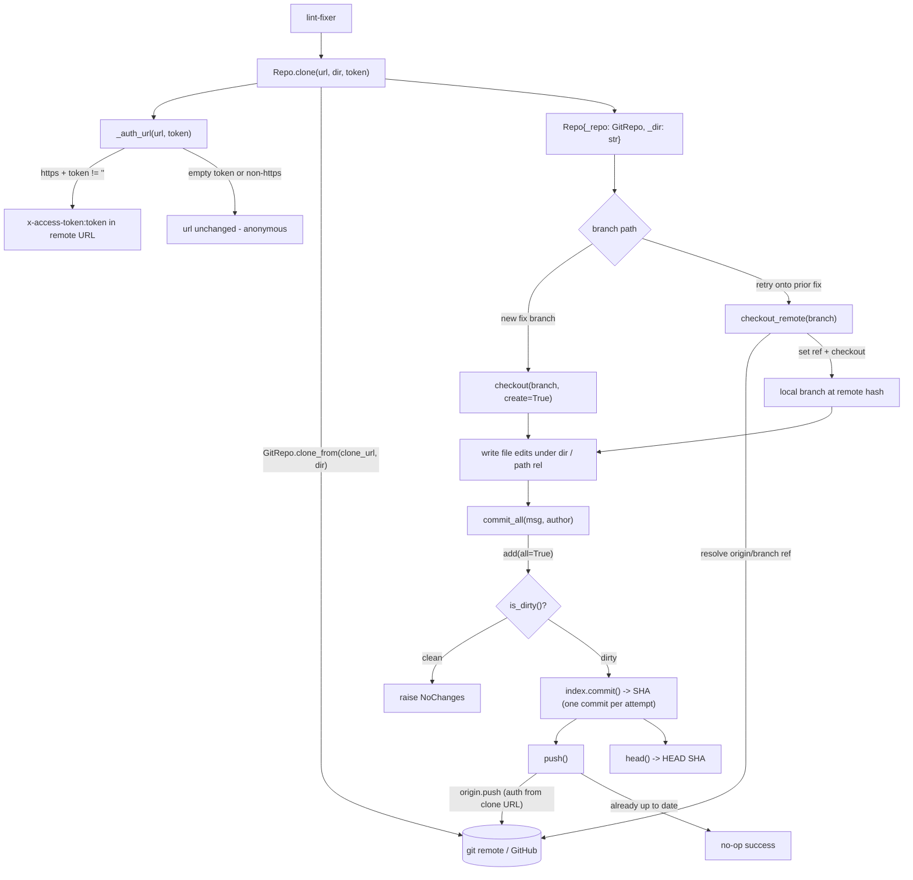

# automation_agent/gitrepo

Working-tree git operations via `GitPython`:

## Flow

- `clone(url, dir, token)` — token becomes GitHub `x-access-token` HTTP auth.
- `checkout(branch, create)`, `commit_all(msg, author)` (stages all, returns SHA),
  `push()`, `head()`, `path(rel)`.

The lint-fixer writes file edits under `dir()`, then `commit_all` + `push`. The
invariant **one commit per attempt** lets `githubapi.attempt_count` derive the
iteration count. PR creation lives in `githubapi` (an API op, not a git op).

Deterministic tooling — no agent imports. Tested against a local seed repo, so it
exercises real clone/branch/commit/push without network.
