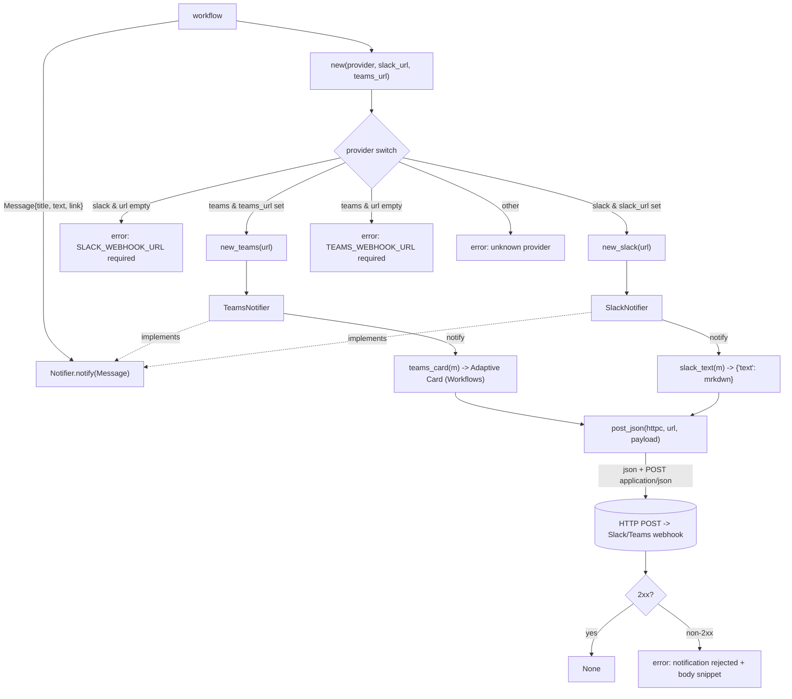

# automation_agent/notify

Posts provider-agnostic `Message`s to Slack or Microsoft Teams behind one
`Notifier` protocol, so the choice is a config flag (`NOTIFY_PROVIDER`).

## Flow

- `slack.py` — Slack incoming webhook (`{"text": ...}`, mrkdwn).
- `teams.py` — Teams **Workflows / Adaptive Card** format (the O365 connector
  MessageCard path is deprecated; we target the new one).
- `new(provider, slack_url, teams_url)` picks the implementation.

Deterministic tooling — no agent imports. Tested with `respx` capturing the
posted body; no real Slack/Teams calls.
