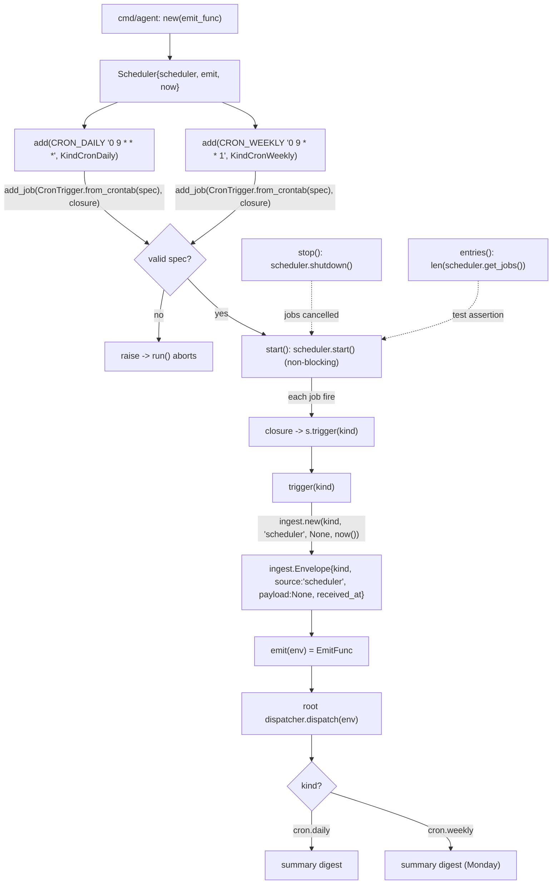

# automation_agent/scheduler

Wraps `APScheduler` (`CronTrigger`) to emit `ingest.Envelope`s on a schedule, so time
triggers flow through the same root-agent path as any other ingress.

## Flow

- `add(spec, kind)` registers a 5-field cron spec (e.g. `0 9 * * *` daily,
  `0 9 * * 1` Mondays) via `CronTrigger.from_crontab`.
- `trigger` is factored out of the cron closure so the emit path is unit-testable
  without waiting on real time; `now` is injectable.

Note: the Monday lint trigger is expected to come from an external CI job posting to
`/webhooks/lint`, not from a cron here — see `docs/architecture.md` §8.
