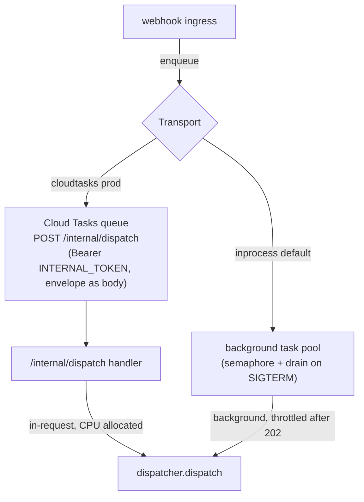

# automation_agent/tasks

The execution transport between webhook ingress and the dispatcher. Webhook ingress reduces
a request to an `ingest.Envelope` and calls `Transport.enqueue`, which returns fast; the
envelope's workflow runs **later** — and, in production, **in-request** so Cloud Run keeps
CPU allocated for the whole (multi-minute LLM) compute. See
`specs/20260626-workflow-execution-transport.md`.

## Why this exists

On Cloud Run with request-based billing, CPU is throttled to near-zero once the response is
sent. The old design ran each dispatch in a background task *after* the 202, so a long
compute was starved and the instance could be reclaimed mid-run. Cloud Tasks is the
primitive that fixes it: **durable retry with backoff**, **rate limiting** (the queue's
`max-concurrent-dispatches`), and an **explicit in-request HTTP target**.

## Backends (config-switched via `TASKS_BACKEND`, like `SESSION_BACKEND`)

- **`InProcess`** (default, local dev) — reproduces the pre-transport behavior exactly:
  bounded task pool (semaphore), `close` drains in-flight work. Not durable; a reclaim loses
  work — which is why prod uses Cloud Tasks.
- **`CloudTasks`** (production) — enqueues each envelope as an HTTP-target task pointed at
  `/internal/dispatch`, carrying the JSON-encoded envelope as the body and the static
  `INTERNAL_TOKEN` as a Bearer header (the same auth that endpoint already enforces). The
  real `google-cloud-tasks` async client is isolated behind the one-method `Submitter`
  protocol so task-building is unit-tested without a live gRPC connection. Each task sets an
  **explicit dispatch deadline** (`TASKS_DISPATCH_DEADLINE`, default/max `30m`) — the
  HTTP-target default is only 10m, so a longer workflow would be cancelled mid-run and
  retried, duplicating side effects.

## Hints

`name` (Cloud Tasks dedup, ~1h) and `delay` (schedule delay, e.g. a review debounce) are
*optional* keyword arguments on `enqueue` and Cloud-Tasks-only. The transport stays
deliberately dumb: coalesce-to-latest / staleness logic lives in the workflow, not here
(spec Decision §3).

## Boundaries

Deterministic tooling — **no agent imports**. The dispatcher is injected as a `DispatchFunc`,
and the envelope wire codec (`encode` / `decode`) lives in `automation_agent/ingest` (the
cross-port wire contract). The `/internal/dispatch` worker handler lives in
`automation_agent/webhook` next to the other `/internal/*` endpoints.
