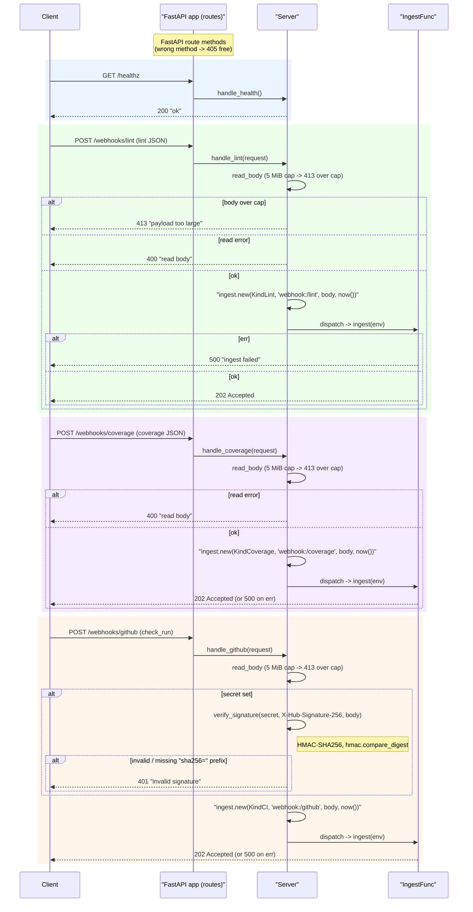

# automation_agent/webhook

The HTTP ingress. A liveness probe, three public POST webhooks, and three Bearer-guarded
`/internal/*` endpoints. The public webhooks plus the **Cloud Scheduler** ingress (daily
digest + durable timeout sweep) reduce a request to an `ingest.Envelope` and hand it to an
`IngestFunc` (which should enqueue via the `tasks` transport and return fast). The **Cloud
Tasks** worker (`/internal/dispatch`) instead decodes the queued envelope and runs the
dispatcher (a `DispatchFunc`) synchronously, in-request:

## Flow

- `GET /healthz` — liveness; returns `200 "ok"`.
- `POST /webhooks/lint` — lint-fixer **kickoff** (agnostic lint JSON) -> `KindLint`.
- `POST /webhooks/coverage` — coverage-fixer **kickoff** (coverage JSON) -> `KindCoverage`.
- `POST /webhooks/github` — fix-engine **resume** (GitHub `check_run`) -> `KindCI`,
  HMAC-verified via `X-Hub-Signature-256` when a secret is configured.
- `POST /internal/cron/daily` — Cloud Scheduler daily digest -> `KindCronDaily`.
- `POST /internal/sweep` — Cloud Scheduler-driven durable timeout catch-all -> the injected
  `SweepFunc` (each engine's `sweep_timeouts`); `501` if no sweep is wired.
- `POST /internal/dispatch` — the **Cloud Tasks worker** (`DispatchFunc`, wired via the
  `dispatch=` arg). It decodes the queued `ingest.Envelope` and runs the dispatcher
  **synchronously, in-request**, so on Cloud Run CPU stays allocated for the whole compute (a
  post-202 background task would be throttled). Retry classification follows Cloud Tasks'
  retry-on-non-2xx contract: a transient dispatch error → `500` (the queue retries with
  backoff); a poison body (undecodable / unknown `Kind`) → `200` + log (acked so the queue
  drops it instead of looping). Returns `501` when no dispatcher is wired. See
  `specs/20260626-workflow-execution-transport.md` and `automation_agent/tasks`.

The `/internal/*` endpoints are Bearer-authenticated with `internal_token` (`INTERNAL_TOKEN`),
constant-time-compared. With **no** token they are **disabled (404)** — never open by default;
the Cloud Tasks transport attaches that same token, so `/internal/dispatch` reuses the check
verbatim. The daily schedule lives GCP-side (Cloud Scheduler), so the instance can scale to
zero between fires (see `DEPLOYMENT.md`).

FastAPI route methods give 405s for free. Each body is read with a 5 MiB cap: oversize
bodies are **rejected with `413`**, not truncated — truncation would break HMAC-SHA256
verification and produce malformed JSON downstream. Deterministic tooling — no agent
imports. Fully tested with the FastAPI `TestClient`.
