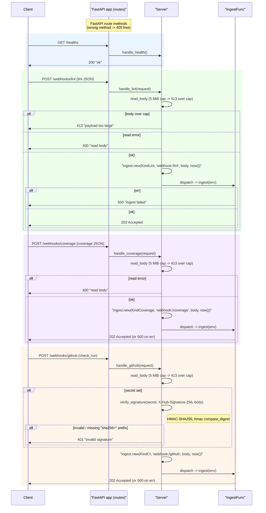

# automation_agent/webhook

The HTTP ingress. Four routes — a liveness probe plus three POST webhooks — reduce
requests to an `ingest.Envelope` and hand them to an `IngestFunc` (which should enqueue
and return fast):

## Flow

- `GET /healthz` — liveness; returns `200 "ok"`.
- `POST /webhooks/lint` — lint-fixer **kickoff** (agnostic lint JSON) -> `KindLint`.
- `POST /webhooks/coverage` — coverage-fixer **kickoff** (coverage JSON) -> `KindCoverage`.
- `POST /webhooks/github` — fix-engine **resume** (GitHub `check_run`) -> `KindCI`,
  HMAC-verified via `X-Hub-Signature-256` when a secret is configured.

FastAPI route methods give 405s for free. Each body is read with a 5 MiB cap: oversize
bodies are **rejected with `413`**, not truncated — truncation would break HMAC-SHA256
verification and produce malformed JSON downstream. Deterministic tooling — no agent
imports. Fully tested with the FastAPI `TestClient`.
