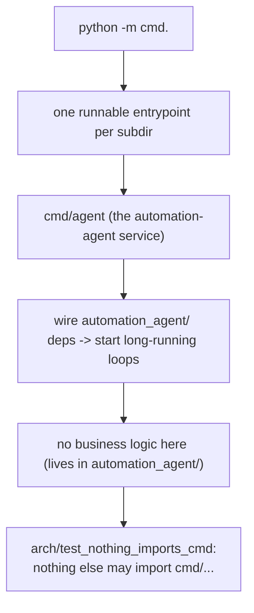

# cmd

Executable entrypoints. Each subdirectory is a runnable module (a `__main__`-style
entrypoint).

## Flow

- `agent/` — the automation-agent service.

Entrypoints wire dependencies together and start long-running loops; they hold no
business logic (that lives in `automation_agent/`). Nothing else in the repo may import
`cmd/...` (enforced by `arch/`).
