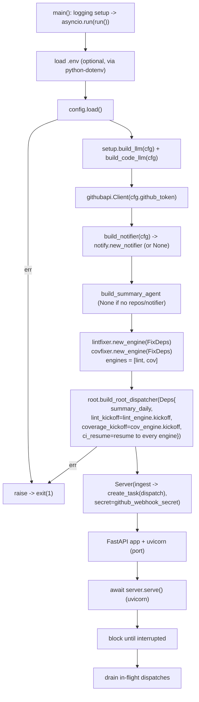

# cmd/agent

The service entrypoint. Responsibilities (built out across phases):

## Flow

1. Load `config`.
2. Build the LLMs (`automation_agent/agent/setup`), tooling, and the
   root + summary agents plus the lint-fixer and coverage-fixer `fixflow` engines.
3. Start the webhook HTTP server (FastAPI + uvicorn). The daily digest is driven by
   Cloud Scheduler calling `POST /internal/cron/daily`; the service runs no internal timer.
4. Block until interrupted, then drain in-flight webhook dispatches.

The fix loop suspends across the CI wait (ADK long-running suspend/resume). Both the ADK
session and the parked run are persisted through `SESSION_BACKEND` (`memory` | `sqlite` |
`firestore`) via `setup.ParkStore`, so a durable backend resumes in-flight runs after a
restart (the default `memory` backend stays ephemeral). Each wait is freed by a per-run
`CI_TIMEOUT` timer and the durable `/internal/sweep` catch-all (driven by Cloud Scheduler).

Keep this module thin — it is composition only. Anything testable belongs in
`automation_agent/`.
