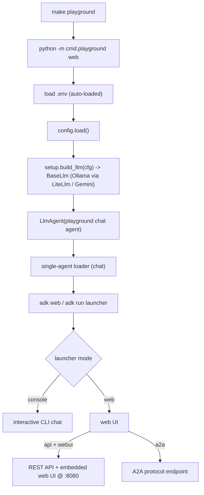

# cmd/playground

A local-only entrypoint that launches ADK's embedded web UI (or a one-shot CLI) to
interact with the configured model. **Development only** — a separate entrypoint from
`cmd/agent`, so it is never in a production artifact, yet still imported by the test
suite / lint pass (preferred over conditional skips, which would hide breakage).

## Flow

Modes: the web UI serves the REST API + embedded UI, so `make playground` runs the
web launcher (per the ADK docs). `console` gives an interactive CLI. `.env` is auto-loaded.

To drive the real workflows interactively, swap the chat agent for the
`summary`/`lintfixer` agents in the entrypoint. Not part of the prod deploy (which runs
only `cmd/agent`).
